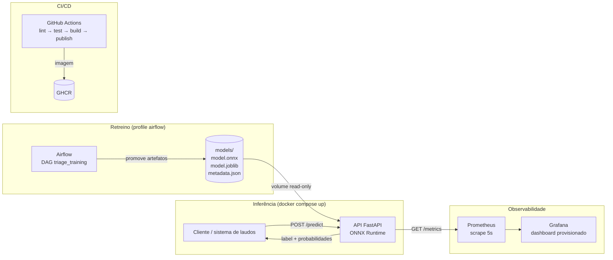
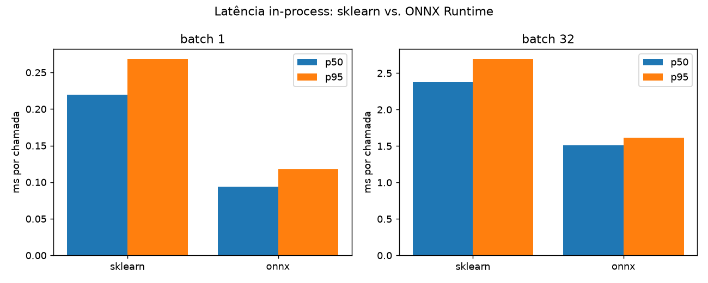
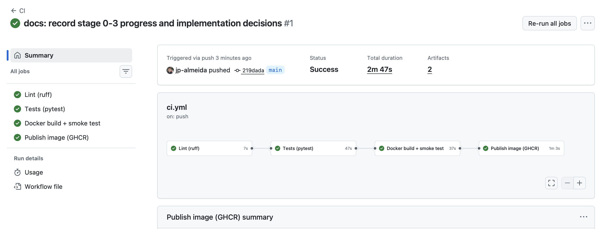
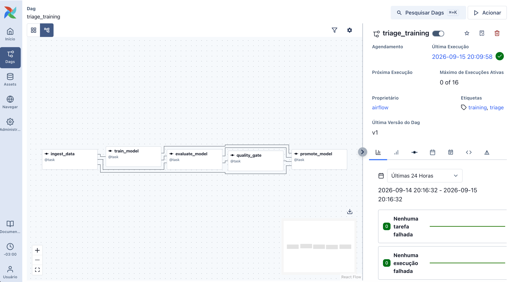
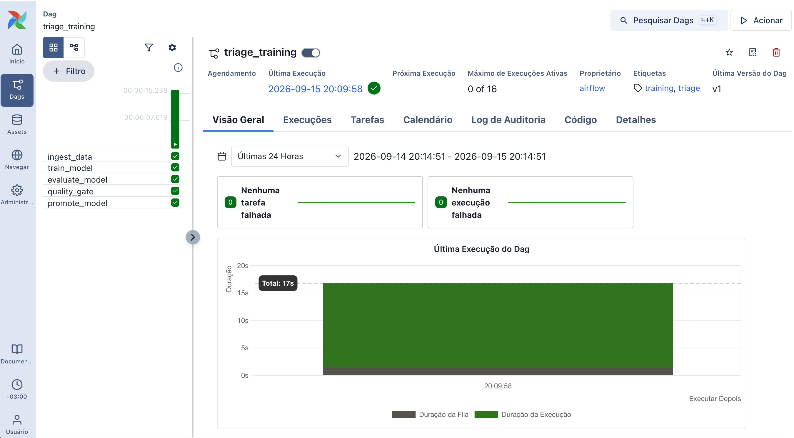
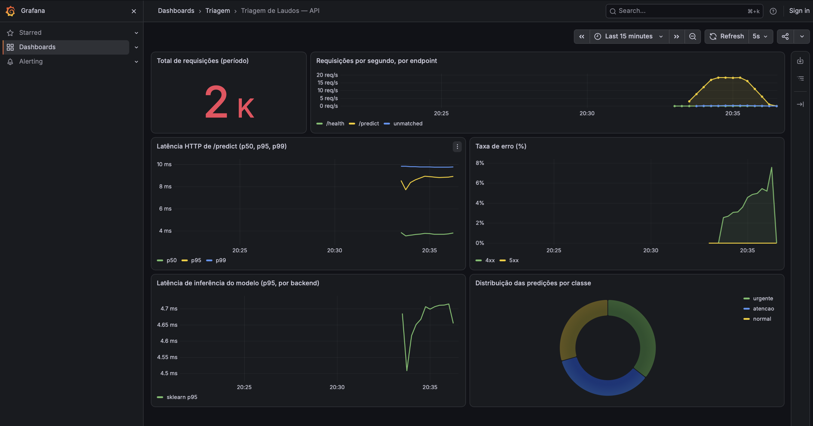

# Triagem Automática de Laudos Médicos

[](https://github.com/jp-almeida/tech-challenge-f3/actions/workflows/ci.yml)

Classificador de laudos em três níveis de prioridade — **`normal`**, **`atencao`** e **`urgente`** —
servido por uma API em container. O projeto cobre o ciclo completo de MLOps: treino versionado,
retreino orquestrado por Airflow, CI/CD no GitHub Actions, monitoramento com Prometheus e Grafana,
e otimização de latência com ONNX Runtime (**2,3× mais rápido** que o scikit-learn puro).

**Tech Challenge — Fase 3 · Pós-Tech Machine Learning Engineering (FIAP)**

🎥 **Vídeo de apresentação:** 

---

## Sumário

- [1. Contexto e problema](#1-contexto-e-problema)
- [2. Arquitetura local](#2-arquitetura-local)
- [3. Decisão arquitetural em nuvem](#3-decisão-arquitetural-em-nuvem)
- [4. Dados e mapeamento de rótulos](#4-dados-e-mapeamento-de-rótulos)
- [5. Modelo e métricas](#5-modelo-e-métricas)
- [6. Otimização e resultados de latência](#6-otimização-e-resultados-de-latência)
- [7. Como executar](#7-como-executar)
- [8. CI/CD](#8-cicd)
- [9. Orquestração do retreino (Airflow)](#9-orquestração-do-retreino-airflow)
- [10. Monitoramento](#10-monitoramento)
- [11. Estrutura do repositório](#11-estrutura-do-repositório)
- [12. Convenção de commits](#12-convenção-de-commits)
- [13. Limitações, riscos e próximos passos](#13-limitações-riscos-e-próximos-passos)
- [14. Referências e equipe](#14-referências-e-equipe)

---

## 1. Contexto e problema

Num hospital, laudos e relatórios clínicos chegam em fila e costumam ser lidos por ordem de
chegada. O problema é que **a fila não distingue um achado incidental de um infarto em curso**.
Quando um caso tempo-dependente — um AVC isquêmico, uma síndrome coronariana aguda — espera horas
por leitura, a janela terapêutica encolhe, e o desfecho clínico piora.

Este projeto ataca esse gargalo com **priorização automática**: assim que um laudo é finalizado, o
texto é classificado em três níveis de urgência, e a fila passa a ser ordenada por prioridade em
vez de por horário.

> ⚠️ **O sistema é apoio à decisão, não diagnóstico.** Ele reordena uma fila de leitura; nenhuma
> conduta clínica deve ser tomada a partir da saída do modelo sem avaliação humana. Veja as
> [limitações](#13-limitações-riscos-e-próximos-passos) antes de qualquer leitura otimista dos números.

**Requisito que orienta todo o desenho:** um laudo urgente precisa ser sinalizado em **segundos**,
não na próxima janela de processamento. Isso é o que justifica a escolha de inferência real-time
(seção 3) e a atenção dedicada à latência (seção 6).

---

## 2. Arquitetura local



**Como as peças se encaixam:**

| Peça | Papel | Onde está |
|---|---|---|
| **API FastAPI** | Recebe o texto, normaliza, infere e devolve a classe com probabilidades | [src/triage/api/](src/triage/api/) |
| **ONNX Runtime** | Backend de inferência padrão (o scikit-learn segue disponível por variável de ambiente) | [src/triage/export_onnx.py](src/triage/export_onnx.py) |
| **Prometheus** | Coleta as métricas da API a cada 5 s | [monitoring/prometheus/](monitoring/prometheus/) |
| **Grafana** | Dashboard com 6 painéis, provisionado automaticamente | [monitoring/grafana/](monitoring/grafana/) |
| **Airflow** | Executa o pipeline de retreino e promove o modelo aprovado | [airflow/dags/](airflow/dags/) |
| **GitHub Actions** | Lint, testes, build da imagem com smoke test e publicação no GHCR | [.github/workflows/ci.yml](.github/workflows/ci.yml) |

O ponto de desacoplamento importante: **a lógica de treino vive em funções Python puras**
([src/triage/pipeline.py](src/triage/pipeline.py)), testadas sem Airflow. A DAG é apenas um
invólucro fino. Isso significa que o pipeline roda igual com `make train`, dentro do Airflow ou em
qualquer outro orquestrador — e que uma falha do Airflow nunca impede o retreino.

---

## 3. Decisão arquitetural em nuvem

> Esta seção é **documental**: descreve como o sistema seria implantado em produção. Nenhum recurso
> de nuvem foi provisionado neste projeto.

### 3.1 Requisitos que guiam a decisão

1. **Urgência é tempo-dependente.** Um laudo grave precisa ser sinalizado em segundos.
2. **Volume moderado, com picos.** Hospitais concentram demanda em turnos; a carga não é uniforme.
3. **Dados sensíveis.** Laudos são dados pessoais sensíveis de saúde (LGPD, art. 5º, II).
4. **Modelo leve.** TF-IDF + regressão logística em ONNX responde em **décimos de milissegundo** em
   CPU, sem precisar de GPU.

### 3.2 Batch, real-time ou orientado a eventos?

| Abordagem | Como funcionaria | Por que (não) escolhemos |
|---|---|---|
| **Batch** (job de hora em hora ou noturno) | Acumula laudos e classifica em lote | Mais barato e simples, mas **um laudo urgente pode esperar a próxima janela** — risco clínico inaceitável como caminho principal |
| **Real-time síncrono** (API HTTP) | O sistema de laudos chama a API ao finalizar o documento e recebe a prioridade na hora | ✅ **Escolhido.** Atende o requisito de segundos e é viável: o modelo responde em milissegundos em CPU comum |
| **Orientado a eventos** (fila) | O evento de "laudo finalizado" cai numa fila; um worker classifica e grava a prioridade de volta | ✅ **Complementar.** Desacopla picos e integra melhor com RIS/HIS via HL7 FHIR. Mesma imagem, consumindo de fila em vez de HTTP |

**Decisão:** **inferência real-time como caminho principal**, exposta como API síncrona e, onde a
integração exigir, consumida por eventos. **Batch permanece como via complementar** para dois casos
concretos: reprocessar o backlog histórico e reclassificar laudos após um retreino que mude o modelo.

### 3.3 Mapeamento de componentes (AWS como referência)

| Necessidade | AWS (escolhido) | GCP | Azure |
|---|---|---|---|
| Registro de imagem | ECR | Artifact Registry | ACR |
| Serviço de inferência | **ECS Fargate** atrás de ALB, autoscaling por CPU/RPS, ≥ 2 tarefas em AZs distintas | Cloud Run (`min-instances ≥ 1`) | Container Apps |
| Artefatos de modelo | S3 com versionamento | GCS | Blob Storage |
| Orquestração de retreino | MWAA (Airflow gerenciado) | Cloud Composer | Airflow em AKS |
| Métricas e dashboards | Amazon Managed Prometheus + Managed Grafana | Managed Prometheus + Cloud Monitoring | Azure Monitor + Managed Grafana |
| Batch complementar | ECS Scheduled Task / AWS Batch | Cloud Run Jobs | Container Apps Jobs |
| CI/CD | GitHub Actions via OIDC → ECR → deploy ECS | idem → Cloud Run | idem → Container Apps |

**Por que ECS Fargate:** o serviço é um container CPU-only, sem estado e pequeno. O Fargate entrega
autoscaling e multi-AZ sem nenhum servidor para administrar, e o mesmo `Dockerfile` deste repositório
sobe sem alteração.

### 3.4 Alternativas descartadas

- **Lambda / serverless puro.** O cold start somado ao tamanho do runtime ONNX ataca justamente o
  p99 dos casos urgentes. É contornável com *provisioned concurrency*, mas aí o custo e a
  complexidade se aproximam do Fargate sem vantagem clara.
- **Kubernetes gerenciado (EKS).** Overhead operacional desproporcional para **um** serviço de
  inferência. Faria sentido se houvesse uma dezena de modelos com necessidades distintas.
- **Endpoint gerenciado de ML (SageMaker real-time).** Tecnicamente adequado, porém mais caro para um
  modelo linear que roda confortavelmente num container pequeno. Passaria a valer a pena junto com
  *model registry*, testes A/B e monitoramento de drift gerenciados.

### 3.5 Segurança e conformidade

- Tarefas em **subnets privadas**; exposição só via ALB com **TLS**.
- **Criptografia em repouso** (KMS) no S3 de artefatos e nos logs.
- **IAM de menor privilégio** por tarefa; CI autentica por **OIDC**, sem chave estática no GitHub.
- **O texto do laudo nunca é registrado em log** — regra já implementada na API deste repositório.
- Autenticação na borda (gateway ou mTLS), trilha de auditoria e política de retenção.

### 3.6 Escalabilidade e custo

O custo é dominado por horas de container, já que não há GPU. Com tarefas pequenas (0,5 vCPU / 1 GB),
autoscaling por RPS e **mínimo de 2 réplicas** por disponibilidade, a conta cresce de forma linear e
previsível com o volume de laudos. *Não citamos valores em reais aqui de propósito: preço varia por
região e data, e um número inventado no README envelhece mal.*

---

## 4. Dados e mapeamento de rótulos

**Fonte:** [Medical Abstracts TC Corpus](https://github.com/sebischair/Medical-Abstracts-TC-Corpus)
— 14.438 resumos médicos em inglês, rotulados em 5 categorias de condição. Os CSVs estão
**versionados** em [data/raw/](data/raw/) para que CI, Docker e Airflow funcionem offline e de forma
reprodutível.

O dataset original **não traz rótulo de urgência**. Nós o derivamos por especialidade, e isso é a
limitação mais importante deste trabalho:

| Categoria original | → Classe | `label_id` | Justificativa do *proxy* |
|---|---|:---:|---|
| Nervous system diseases | `urgente` | 2 | Quadros neurológicos agudos (ex.: AVC) são tempo-dependentes |
| Cardiovascular diseases | `urgente` | 2 | Quadros cardiovasculares agudos (ex.: IAM) são tempo-dependentes |
| Neoplasms | `atencao` | 1 | Exigem investigação prioritária, raramente emergência imediata |
| Digestive system diseases | `atencao` | 1 | Idem |
| General pathological conditions | `normal` | 0 | Fluxo regular |

**Distribuição resultante** — quase balanceada, o que dispensa `class_weight`:

| Classe | Treino | Teste |
|---|---:|---:|
| `normal` | 3.844 | 961 |
| `atencao` | 3.725 | 932 |
| `urgente` | 3.981 | 995 |
| **Total** | **11.550** | **2.888** |

> **Este mapeamento é um proxy, não urgência clínica real.** Um carcinoma metastático com dor
> intratável não é menos urgente que uma cefaleia benigna, mas o mapeamento por especialidade diz o
> contrário. Somado a isso: os textos são resumos científicos em inglês, não laudos hospitalares em
> português. As consequências disso estão na seção 13.

---

## 5. Modelo e métricas

**Pipeline:** `TfidfVectorizer` (unigramas + bigramas, 20.000 features, `min_df=2`) →
`LogisticRegression` (`C=1.0`). Escolhido por ser leve, interpretável, rápido em CPU e por gerar um
grafo ONNX pequeno.

**Resultados no conjunto de teste (2.888 amostras nunca vistas no treino):**

| Métrica | Valor |
|---|---:|
| Acurácia | **0,6115** |
| **F1 macro** | **0,6078** |

| Classe | Precisão | Recall | F1 | Suporte |
|---|---:|---:|---:|---:|
| `normal` | 0,483 | 0,432 | 0,456 | 961 |
| `atencao` | 0,685 | 0,726 | 0,705 | 932 |
| `urgente` | 0,647 | 0,677 | 0,662 | 995 |

**Leitura honesta desses números.** F1 macro de 0,61 contra uma linha de base aleatória de ~0,33 é um
sinal real, mas está longe de uso clínico. A classe `normal` é a mais fraca (F1 0,456) por um motivo
identificável: ela corresponde a *"general pathological conditions"*, uma categoria heterogênea que
funciona como sacola de resto no dataset original — e o modelo a confunde com as demais. **O foco
desta fase é a esteira de MLOps, não o teto de acurácia**; a seção 13 lista o que elevaria esse
número.

Um **quality gate** automático (`TRIAGE_QUALITY_GATE_F1=0.58`) bloqueia a promoção de qualquer modelo
retreinado que fique abaixo do limiar. Ele é verificado tanto por `make train` quanto pela DAG.

Relatório completo: [reports/metrics/classification_report.json](reports/metrics/classification_report.json).

---

## 6. Otimização e resultados de latência

**Técnica aplicada: conversão para ONNX Runtime.** O pipeline scikit-learn inteiro (vetorizador +
classificador) vira um único grafo ONNX, executado com `intra_op_num_threads=1` e sem ZipMap — a
saída de probabilidades é um tensor, não uma lista de dicionários.



| Cenário | Backend | Batch | p50 (ms) | p95 (ms) | p99 (ms) | Throughput | Speedup p50 |
|---|---|---:|---:|---:|---:|---:|---:|
| In-process | sklearn | 1 | 0,2194 | 0,2686 | 0,3118 | 4.487/s | 1,00× |
| In-process | **onnx** | 1 | **0,0938** | 0,1175 | 0,1309 | 10.449/s | **2,34×** |
| In-process | sklearn | 32 | 2,3782 | 2,6962 | 2,7410 | 13.350/s | 1,00× |
| In-process | **onnx** | 32 | **1,5089** | 1,6171 | 1,6511 | 21.125/s | **1,58×** |
| HTTP (Docker) | sklearn | 1 | 1,4037 | 2,0038 | 2,3663 | 673/s | 1,00× |
| HTTP (Docker) | **onnx** | 1 | **1,0446** | 1,6311 | 2,0843 | 865/s | **1,34×** |

*Apple M4, macOS 26.6.2, `OMP_NUM_THREADS=1`, 1.000 requisições por medição, 0 erros.*

**Por que o ganho ponta a ponta (1,34×) é menor que o in-process (2,34×)?** Porque a inferência
deixou de ser o gargalo. Com o ONNX, o modelo responde em ~0,09 ms, enquanto a requisição HTTP
completa leva ~1,04 ms — ou seja, **mais de 90% do tempo é overhead de rede, parsing de JSON e
validação**. Otimizar o modelo além disso renderia pouco no tempo que o cliente percebe; o próximo
alvo seria o transporte, não o modelo. Preferimos mostrar isso a esconder atrás do número in-process,
que é mais bonito e menos verdadeiro.

**Paridade verificada:** **100% de concordância de rótulos** nos 2.888 textos de teste, com diferença
mediana de probabilidade de 3,1e-8. O artefato ONNX ainda é **34% menor** (0,80 MB contra 1,21 MB).

<details>
<summary>Nota técnica: por que o gate de paridade usa mediana e p99,9, e não o máximo absoluto</summary>

A diferença máxima observada é 2,2e-2, concentrada em pouquíssimos textos. A causa foi rastreada: o
operador `TfIdfVectorizer` do ONNX monta n-gramas a partir do *pool* de unigramas e, por isso,
descarta bigramas cujo componente não esteja no vocabulário. Neste modelo isso atinge **exatamente 1
dos 12.673 bigramas** — `"von hippel"`, porque `hippel` sozinho foi podado pelo `min_df=2`. Nos
textos que contêm "von Hippel-Lindau", a renormalização L2 desloca todas as probabilidades em ~1e-2,
**sem trocar o rótulo**.

Some-se a isso a ordem de acumulação em float32, que difere entre o BLAS do scikit-learn e os
kernels do ONNX Runtime — e difere também **entre arquiteturas de CPU**: medimos p99,9 de 9e-4 em
Apple Silicon e 2,8e-3 em x86, sem nenhuma troca de rótulo em nenhum dos dois.

Por isso o gate cobra o que é invariante — **concordância de rótulos ≥ 99,5%** — usa a **mediana
(≤ 1e-4)** para detectar divergência sistemática e deixa o **p99,9 (≤ 1e-2)** apenas como rede de
segurança para a cauda. Foi a mediana que reprovou a configuração com `sublinear_tf` ligado, cujo
valor ficava em ~3e-3, quatro ordens de grandeza acima do normal.
</details>

Números completos: [reports/latency/comparison.md](reports/latency/comparison.md) ·
Reproduza com `make bench-models` e `make bench-api BACKEND=onnx`.

---

## 7. Como executar

### Pré-requisitos

- **Docker Desktop** com **≥ 6 GB** de RAM alocados (o perfil do Airflow sozinho usa ~1 GB)
- **Python 3.12** e **make** — apenas para desenvolvimento local e benchmarks

> **Windows:** o Makefile detecta o sistema operacional e usa `.venv/Scripts` e o `py launcher`
> automaticamente. O quickstart com Docker não precisa de `make`; para os alvos de desenvolvimento,
> instale o GNU Make (por exemplo, `choco install make`) e rode pelo terminal de sua preferência.

### Quickstart (3 comandos)

```bash
git clone https://github.com/jp-almeida/tech-challenge-f3.git
cd tech-challenge-f3
docker compose up -d --build     # ou: make up
```

Em menos de dois minutos a stack sobe inteira. Gere tráfego para ver os gráficos se moverem:

```bash
make load-test                   # ~2 min de carga, com erros propositais
```

| Serviço | URL | Acesso |
|---|---|---|
| **API — Swagger** | http://localhost:8000/docs | — |
| API — health | http://localhost:8000/health | — |
| API — métricas | http://localhost:8000/metrics | — |
| **Prometheus** | http://localhost:9090/targets | — |
| **Grafana** | http://localhost:3000 | `admin` / `admin` (ou anônimo como Viewer) |

### Exemplo de chamada

```bash
curl -X POST http://localhost:8000/predict \
  -H 'Content-Type: application/json' \
  -d '{"text": "Acute ischemic stroke with left hemiparesis and aphasia after occlusion of the middle cerebral artery."}'
```

```json
{
  "label": "urgente",
  "label_id": 2,
  "probabilities": { "normal": 0.204, "atencao": 0.017, "urgente": 0.779 },
  "model_version": "20260915T234937Z",
  "backend": "onnx",
  "inference_ms": 0.19
}
```

### Endpoints

| Método | Rota | Descrição |
|---|---|---|
| `GET` | `/health` | Liveness e readiness; `503` enquanto o modelo não estiver carregado |
| `POST` | `/predict` | Classifica um laudo (texto entre 10 e 20.000 caracteres) |
| `GET` | `/model/info` | Conteúdo do `metadata.json`: versão, métricas, parâmetros |
| `GET` | `/metrics` | Exposição no formato Prometheus |

### Desenvolvimento local

```bash
make setup      # cria .venv e instala requirements/dev.txt
make test       # pytest com cobertura (48 testes)
make lint       # ruff check + ruff format --check
make train      # pipeline completo: ingestão → treino → avaliação → gate → ONNX → promoção
make api        # uvicorn com --reload
```

### Airflow e benchmarks

```bash
make up-airflow                  # sobe o Airflow (profile separado) em :8080
make dag-test                    # executa a DAG inteira sem o scheduler, com logs no terminal
make test-dag                    # testes de integridade da DAG dentro da imagem do Airflow

make bench-models                # benchmark in-process: sklearn vs onnx
make bench-api BACKEND=onnx      # benchmark HTTP ponta a ponta
```

> Se a porta 8080 já estiver ocupada na sua máquina: `AIRFLOW_PORT=8081 make up-airflow`.

### Variáveis de ambiente

| Variável | Padrão | Uso |
|---|---|---|
| `TRIAGE_MODEL_BACKEND` | `onnx` | Backend de inferência (`onnx` ou `sklearn`) |
| `TRIAGE_MODEL_DIR` | `./models` | Onde ficam os artefatos |
| `TRIAGE_ORT_THREADS` | `1` | `intra_op_num_threads` do ONNX Runtime |
| `TRIAGE_QUALITY_GATE_F1` | `0.58` | F1 macro mínimo para promover um modelo |
| `TRIAGE_LOG_LEVEL` | `INFO` | Nível de log |

---

## 8. CI/CD



Definido em [.github/workflows/ci.yml](.github/workflows/ci.yml), disparado a cada `push`, em pull
requests para `main` e manualmente. Os jobs são encadeados, então uma falha de lint interrompe tudo
antes de gastar tempo com build:

| Job | O que faz |
|---|---|
| **Lint** | `ruff check` e `ruff format --check` |
| **Tests** | `pytest` com cobertura; publica os relatórios JUnit e de cobertura como artefatos |
| **Docker build + smoke test** | Builda a imagem, sobe o container, aguarda o `/health` e faz um `POST /predict` real, validando o JSON de resposta |
| **Publish (GHCR)** | Só em `main`: publica a imagem com tags `sha` e `latest` |

O smoke test é o detalhe que importa: ele garante que a imagem **realmente serve predições**, e não
apenas que o build terminou sem erro.

---

## 9. Orquestração do retreino (Airflow)



A DAG [`triage_training`](airflow/dags/triage_training_dag.py) roda no Airflow 3.3.1 com a TaskFlow
API. Entre as tasks trafegam apenas caminhos de arquivo e métricas pequenas — **nunca DataFrames**
pelo XCom:

| Task | O que faz |
|---|---|
| `ingest_data` | Garante os CSVs, valida o schema, mapeia os rótulos e grava `data/processed/` |
| `train_model` | Treina o pipeline num diretório de candidato isolado por `run_id` |
| `evaluate_model` | Calcula acurácia, F1 macro e F1 por classe sobre o conjunto de teste |
| `quality_gate` | **Falha o run** se o F1 macro ficar abaixo do limiar (sem retry: reexecutar não muda o resultado) |
| `export_onnx` | Converte para ONNX e valida a paridade contra o scikit-learn |
| `promote_model` | Copia os artefatos para `models/` de forma **atômica** e escreve o `metadata.json` |



**Como a API passa a servir o modelo novo:** o serviço `api` monta `./models` como volume
read-only, então basta reiniciá-lo após a promoção:

```bash
docker compose restart api
curl -s localhost:8000/health   # o model_version deve ter mudado
```

O `promote` grava em arquivo temporário e usa `os.replace`, o que torna a troca atômica: a API nunca
enxerga um `.joblib` ou `.onnx` pela metade.

---

## 10. Monitoramento



A API instrumenta a si mesma com `prometheus_client` ([src/triage/api/metrics.py](src/triage/api/metrics.py)):

| Métrica | Tipo | Labels |
|---|---|---|
| `triage_http_requests_total` | Counter | `method`, `handler`, `status` |
| `triage_http_request_duration_seconds` | Histogram | `method`, `handler` |
| `triage_model_inference_duration_seconds` | Histogram | `backend` |
| `triage_predictions_total` | Counter | `label`, `backend` |
| `triage_model_info` | Gauge | `model_version`, `backend` |

O label `handler` usa sempre o **template da rota** (`/predict`), e qualquer rota não reconhecida vira
`unmatched` — sem isso, um scanner batendo em URLs aleatórias criaria uma série temporal nova a cada
requisição e derrubaria o Prometheus.

O dashboard **"Triagem de Laudos — API"** é provisionado automaticamente (datasource com UID fixo
`prometheus`) e traz 6 painéis: total de requisições, requisições por segundo por endpoint, latência
HTTP p50/p95/p99, taxa de erro 4xx/5xx, latência de inferência por backend e distribuição das
predições por classe. JSON versionado em
[monitoring/grafana/dashboards/triage-api.json](monitoring/grafana/dashboards/triage-api.json).

---

## 11. Estrutura do repositório

```
├── .github/workflows/ci.yml        # pipeline de CI/CD
├── airflow/
│   ├── Dockerfile                  # imagem do Airflow + dependências de treino
│   └── dags/triage_training_dag.py # DAG de retreino
├── data/raw/                       # CSVs originais (versionados)
├── docs/images/                    # prints de Actions, Airflow e Grafana
├── models/                         # model.onnx, model.joblib, metadata.json
├── monitoring/                     # configuração de Prometheus e Grafana
├── reports/
│   ├── latency/                    # benchmarks e comparison.md
│   └── metrics/                    # classification_report.json
├── scripts/                        # download, fixture, benchmarks, load test
├── src/triage/
│   ├── config.py                   # rótulos, caminhos e variáveis de ambiente
│   ├── data.py                     # validação, mapeamento e normalização
│   ├── train.py                    # pipeline sklearn, avaliação e artefatos
│   ├── export_onnx.py              # conversão ONNX e verificação de paridade
│   ├── pipeline.py                 # passos orquestráveis + CLI
│   └── api/                        # FastAPI, schemas, predictors e métricas
├── tests/                          # 48 testes (dados, treino, API, métricas, ONNX, DAG)
├── Dockerfile                      # imagem da API
├── docker-compose.yml              # api + prometheus + grafana (+ airflow em profile)
└── Makefile                        # atalhos de desenvolvimento
```

---

## 12. Convenção de commits

[Conventional Commits](https://www.conventionalcommits.org/): `tipo(escopo): descrição no imperativo`.
Tipos usados: `feat`, `fix`, `docs`, `test`, `ci`, `build`, `chore`, `perf`, `refactor`.

```
feat(onnx): add sklearn to onnx conversion with parity check
perf(onnx): switch default inference backend to onnx runtime
test(metrics): add tests for request counters and status labels
```

Cada etapa do projeto foi commitada em incrementos pequenos, na ordem em que o trabalho aconteceu.
`git log --oneline` mostra o histórico completo.

---

## 13. Limitações, riscos e próximos passos

### O que este sistema não é

- **Não é um diagnóstico.** É uma reordenação de fila. Toda saída exige leitura humana.
- **O rótulo de urgência é um proxy por especialidade**, não urgência clínica aferida. Um caso
  oncológico descompensado seria classificado como `atencao` pelo nosso mapeamento — e isso é uma
  falha conhecida, não um detalhe.
- **O domínio não corresponde ao uso real.** O modelo foi treinado em resumos científicos em inglês;
  laudos hospitalares brasileiros têm outro vocabulário, outras abreviações e outra língua. **A
  acurácia em produção seria substancialmente menor** sem retreino com dados reais.
- **F1 macro de 0,61 não sustenta decisão clínica autônoma.** Cerca de um terço dos casos é
  classificado errado.

### Riscos

| Risco | Mitigação atual | O que faltaria |
|---|---|---|
| **Falso negativo** (urgente marcado como normal) | Recall de `urgente` medido e publicado (0,677) | Otimizar limiar priorizando recall da classe crítica; revisão humana obrigatória da fila |
| **Privacidade (LGPD)** | O texto do laudo **nunca é registrado em log** | Anonimização, criptografia em repouso, política de retenção, DPIA |
| **Drift** | `model_version` exposto nas métricas e no `/health` | Monitorar distribuição de entrada e das predições; alerta automático |
| **Viés** | — | Auditoria por subgrupo (idade, sexo, procedência) antes de qualquer uso real |

### Próximos passos

1. **Dados reais rotulados por especialistas**, em português, com urgência aferida clinicamente — é o
   passo de maior impacto, de longe.
2. **Monitoramento de drift**: comparar a distribuição de predições com a janela de referência e
   disparar retreino automático.
3. **Modelo mais forte**: um transformer destilado (BioBERT/ClinicalBERT em PT-BR) provavelmente supera
   o TF-IDF — a esteira de ONNX e benchmark já está pronta para medir o trade-off de latência.
4. **Autenticação e rate limiting** na API, hoje sem controle de acesso.
5. **Human-in-the-loop**: coletar a correção do radiologista e realimentar o dataset de treino.

---

## 14. Referências e equipe

### Dataset

Schopf, T.; Braun, D.; Matthes, F. **Evaluating Unsupervised Text Classification: Zero-Shot and
Similarity-Based Approaches.** *Proceedings of the 2022 6th International Conference on Natural
Language Processing and Information Retrieval (NLPIR '22)*, 2023.
[doi:10.1145/3582768.3582795](https://doi.org/10.1145/3582768.3582795)

Repositório: [sebischair/Medical-Abstracts-TC-Corpus](https://github.com/sebischair/Medical-Abstracts-TC-Corpus)
· Licença **CC BY-SA 3.0**.

### Stack

Python 3.12 · scikit-learn 1.8.0 · skl2onnx 1.20.0 · onnxruntime 1.30.0 · FastAPI · Apache Airflow
3.3.1 · Prometheus · Grafana · Docker

### Equipe

| Nome | GitHub |
|---|---|
| João Almeida | [@jp-almeida](https://github.com/jp-almeida) |