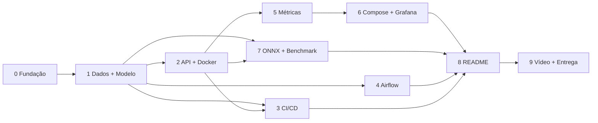

# Guia de Implementação — Tech Challenge Fase 3 (MLET)

**Tema:** Triagem automática de laudos (normal / atenção / urgente) servida via API, com CI/CD, retreino orquestrado (Airflow), monitoramento (Prometheus + Grafana) e otimização de latência (ONNX).

> **Status:** Etapas 0–3 concluídas; Etapa 4 implementada e validada, faltando os prints da UI do Airflow.
> **Versões e dataset verificados em:** 15/09/2026.
> Documento vivo: marque os checkboxes ao concluir cada item e registre desvios na seção "Registro de decisões" no final.

---

## Como usar este guia

1. **Antes de qualquer etapa**, leia: §1 (Resumo), §2 (Riscos) e §3 (Contratos globais). Os contratos são o que permite começar uma etapa sem conhecer os detalhes da anterior.
2. Cada etapa tem sempre a mesma estrutura: **Objetivo · Depende de · Pré-checagem · Tarefas · Arquivos · Critérios de aceite · Commits sugeridos · Armadilhas · Handoff** (o estado garantido ao final).
3. Legenda de prioridade:
   - **[OBRIG]** exigido pelo enunciado — **nunca cortar**.
   - **[REC]** recomendado (robustez/nota) — cortar só em último caso.
   - **[OPC]** opcional — primeiro a ser cortado se o prazo apertar.
4. Nomenclatura: **"Etapa N"** = etapa deste guia (0–9). **"Enunciado E1–E4"** = etapas do PDF.

---

## 1. Resumo executivo

| Etapa | Nome | Enunciado | Esforço (h) | Depende de | Risco |
|---|---|---|---|---|---|
| 0 | Fundação do repositório | transversal (commits) | 1 | — | baixo |
| 1 | Dados + modelo baseline (+ spike ONNX) | E4 (treino) | 3 | 0 | **médio** |
| 2 | API FastAPI + Docker + baseline de latência | E1 | 3 | 1 | baixo |
| 3 | CI/CD com GitHub Actions | E2 | 1,5 | 1 (2 p/ job de build) | baixo |
| 4 | DAG Airflow de treino/retreino | E2 | 3–4 | 1 | **alto** |
| 5 | Instrumentação Prometheus na API | E3 | 1,5 | 2 | baixo |
| 6 | Compose (API + Prometheus + Grafana) + dashboard | E3 | 3 | 5 | médio |
| 7 | Otimização ONNX + comparação de latência | E4 | 3 | 1, 2 | **médio** |
| 8 | README + decisão arquitetural em nuvem | E1 + documentação | 2–3 | todas (seção nuvem pode começar após 0) | baixo |
| 9 | Vídeo STAR + entrega | E4 | 2–3 | todas | médio (limite 5 min) |

**Total estimado:** ~24–28 h de trabalho efetivo (1 pessoa). Com folga: ~3 dias corridos intensos.

### Grafo de dependências



### Ordem de execução recomendada (prazo curto, riscos altos primeiro)

- **Dia 1:** Etapa 0 → 1 (com spike ONNX) → 2 → 3
- **Dia 2:** Etapa 4 (Airflow, maior risco, de manhã) → 7 (ONNX + benchmark)
- **Dia 3:** Etapa 5 → 6 → 8 → 9 (gravar o vídeo com folga de pelo menos meio dia antes do prazo)

### Divisão sugerida em grupo (após Etapas 0 e 1 concluídas — elas fixam os contratos)

| Pessoa | Etapas | Interface com os demais |
|---|---|---|
| A | 2, 5, 6 | Contrato da API (§3.5) e métricas (§3.7) |
| B | 4 | Funções de `triage.pipeline` (§3.4) |
| C | 3, 7 | Artefatos do modelo (§3.4) e `Predictor` (§3.5) |
| D | 8, 9 | Consome prints/relatórios de todos |

---

## 2. Riscos que podem comprometer a entrega

| # | Risco | Severidade | Impacto | Mitigação (já incorporada nas etapas) |
|---|---|---|---|---|
| R1 | **Airflow** é pesado e cheio de detalhes de setup (versão 3.x mudou imports, auth e executores). Pode consumir o dia inteiro. | **Alta** | Critério "Orquestração" (15%) e requisito obrigatório "DAG funcional". | Toda lógica de treino fica em funções Python puras (`triage.pipeline`), testadas sem Airflow. A DAG é um *wrapper fino*. Airflow roda em **um único container `standalone`** num *profile* separado do Compose. Validar com `airflow dags test` antes de tentar o scheduler. Timebox de 4 h; se estourar, pedir ajuda no Discord cedo. |
| R2 | **Dataset sugerido não tem rótulo de urgência.** O Medical Abstracts TC Corpus tem 5 categorias de doença (não urgência), em inglês, e são resumos científicos, não laudos. | **Média** | Critério "Modelagem" e coerência da narrativa no vídeo. | Mapeamento documentado 5 → 3 classes (§3.2), com distribuição quase balanceada (verificado). Declarar explicitamente como *proxy* e limitação no README e no vídeo. Decidir **no início** (Etapa 1) e não rediscutir. |
| R3 | **Conversão ONNX do TF-IDF** pode divergir do scikit-learn (tokenização, stop words + n-grams, `sublinear_tf`), ou o conversor pode não suportar a versão do scikit-learn. | **Média** | Critério "Modelagem e Otimização" (20%). | (a) Pinar `scikit-learn==1.8.0` + `skl2onnx==1.20.0` (a última release do skl2onnx foi testada contra sklearn 1.8.0; sklearn 1.9.x ainda não tem release compatível). (b) **Spike de 20 min na Etapa 1** para validar a configuração do vetorizador antes de escrever API/DAG. (c) Teste automatizado de paridade. (d) Plano B: vetorização em sklearn + só o classificador em ONNX. |
| R4 | Incompatibilidade de versão do scikit-learn entre container do Airflow (treina) e da API (carrega `.joblib`). | Média | API quebra ao carregar modelo retreinado. | Mesmos `requirements` pinados nos dois; Python 3.12 nos dois. O backend padrão da API em produção será ONNX, que não depende da versão do sklearn. |
| R5 | Grafana mostrando "No data" (UID de datasource divergente no JSON do dashboard, nome de métrica errado, alvo de scrape errado). | Média | Critério "Monitoramento" (20%). | Datasource provisionado com **UID fixo `prometheus`**; nomes de métricas fixados em contrato (§3.7); checagem em `http://localhost:9090/targets`. |
| R6 | Melhoria de latência pequena/ruidosa, difícil de "demonstrar". | Média | Critério de otimização. | Benchmark com aquecimento, muitas iterações, p50/p95/p99, `intra_op_num_threads=1`, e **duas medições**: in-process (diferença clara) e ponta a ponta via HTTP no Docker. Remover ZipMap do ONNX. |
| R7 | Histórico de commits "semântico e organizado" é obrigatório e **não dá para fabricar no fim**. A pasta ainda não é repositório git. | Média | Requisito obrigatório. | `git init` e repositório no GitHub na Etapa 0; commits pequenos por tarefa com Conventional Commits; nunca um commit gigante ao final. |
| R8 | Vídeo com mais de 5 min ou demo ao vivo falhando (Airflow demora a subir). | Média | Critério "Vídeo" (15%). | Roteiro cronometrado (Etapa 9), gravar trechos separadamente com tudo já de pé, ensaiar uma vez. |
| R9 | Memória do Docker Desktop no Mac (API + Prometheus + Grafana + Airflow ≈ 3–4 GB). | Baixa/Média | Containers morrendo (OOM), lentidão. | Airflow em profile separado; Docker Desktop com ≥ 6 GB; não rodar Airflow durante benchmarks. |
| R10 | Instalar Airflow no CI (lento, conflito de dependências). | Baixa | CI lento/quebrado. | CI **não** instala Airflow; teste de DAG é `skip` quando Airflow não está disponível. Validação da DAG em job opcional ou localmente no container. |
| R11 | Uvicorn com múltiplos workers quebra métricas do `prometheus_client` (cada processo tem seu registro). | Baixa | Métricas inconsistentes. | `--workers 1` explícito; escala horizontal por réplicas (documentado na seção de nuvem). |
| R12 | Acesso dos avaliadores ao repositório/vídeo. | Baixa | Entrega não avaliável. | Repositório público (ou avaliadores adicionados); vídeo no YouTube "não listado"; testar links em aba anônima. |

> **Nada do que é obrigatório foi colocado como opcional.** Os itens [OPC] só adicionam valor; o plano de corte está em §6.

---

## 3. Decisões padrão e contratos globais

> Estes contratos são a "API entre etapas". Se precisar mudar algo, altere **aqui primeiro** e registre em "Registro de decisões".

### 3.1 Stack e versões (verificadas em 15/09/2026)

| Componente | Versão/escolha | Observação |
|---|---|---|
| Python | **3.12** (API, CI e Airflow) | sklearn 1.8 exige ≥ 3.11; imagem oficial Airflow `3.3.1-python3.12` existe. |
| scikit-learn | **1.8.0** (pin exato) | Compatível com skl2onnx 1.20.0. **Não usar 1.9.x.** |
| skl2onnx | **1.20.0** | Última release publicada. |
| onnxruntime | 1.30.x | |
| onnx | versão resolvida pelo pip junto do skl2onnx (pinar após instalar) | |
| FastAPI | 0.14x (pinar a instalada) + `uvicorn[standard]` | Pydantic v2. |
| prometheus-client | 0.26.x | Uso direto (sem instrumentator), pois é biblioteca exigida. |
| Airflow | **3.3.1**, imagem `apache/airflow:3.3.1-python3.12` | Imports de DAG via `airflow.sdk`. |
| Prometheus / Grafana | imagens oficiais `prom/prometheus` e `grafana/grafana` com **tag fixa** (nunca `latest`) | Escolher a última estável no dia e registrar. |
| Lint/format | `ruff` (check + format) | |
| Testes | `pytest`, `pytest-cov`, `httpx` (TestClient) | |
| Gestão de deps | `pip` + arquivos em `requirements/` | Simples para Docker/Airflow. (uv é alternativa [OPC].) |
| Modelo | `TfidfVectorizer` + `LogisticRegression` | Leve, bom para texto, probabilidades calibradas o suficiente, ONNX pequeno. RandomForest (exemplo do PDF) só como comparação [OPC]. |
| Otimização | **Conversão para ONNX Runtime** (técnica obrigatória única) | Quantização/pruning apenas [OPC]. |
| Nuvem (documental) | **AWS, inferência real-time** (ECS Fargate) com batch complementar | Apenas documentado no README; **não** é exigido deploy real. |

### 3.2 Dataset e mapeamento para urgência

**Fonte:** Medical Abstracts TC Corpus (GitHub `sebischair/Medical-Abstracts-TC-Corpus`) — download direto, **sem login no Kaggle**:
- `https://raw.githubusercontent.com/sebischair/Medical-Abstracts-TC-Corpus/main/medical_tc_train.csv` (≈14 MB, 11.550 linhas)
- `https://raw.githubusercontent.com/sebischair/Medical-Abstracts-TC-Corpus/main/medical_tc_test.csv` (≈3,6 MB, 2.888 linhas)
- Colunas: `condition_label` (1–5), `medical_abstract` (texto; mediana ~175 palavras, máx. ~600).
- Verificar a licença e a forma de citação no README do repositório original e referenciar no nosso README.

**Mapeamento (decisão padrão):**

| `condition_label` | Nome original | Classe de urgência | `label_id` | Justificativa (proxy) |
|---|---|---|---|---|
| 3 | nervous system diseases | `urgente` | 2 | Condições neurológicas agudas (ex.: AVC) são tempo-dependentes. |
| 4 | cardiovascular diseases | `urgente` | 2 | Condições cardiovasculares agudas (ex.: IAM) são tempo-dependentes. |
| 1 | neoplasms | `atencao` | 1 | Exigem investigação prioritária, mas raramente emergência imediata. |
| 2 | digestive system diseases | `atencao` | 1 | Idem. |
| 5 | general pathological conditions | `normal` | 0 | Fluxo regular. |

**Distribuição resultante (verificada):**

| Classe | Treino | Teste |
|---|---|---|
| normal (0) | 3.844 | 961 |
| atencao (1) | 3.725 | 932 |
| urgente (2) | 3.981 | 995 |

Quase balanceado → não precisa de `class_weight`. ≥ 2.000 amostras atendido com folga.

**Limitações a declarar (README e vídeo):** rótulo é *proxy* por especialidade, não urgência clínica real; textos são resumos científicos em inglês, não laudos; classe 5 é heterogênea (espere F1 macro moderado — o foco da fase é MLOps). Sistema é **apoio à decisão**, não substitui avaliação médica.

**Dados no repositório:** os dois CSVs brutos (~18 MB) são **commitados** em `data/raw/` para que CI, Docker e Airflow funcionem offline e de forma reprodutível. Script de download existe como fallback.

**Fixture de teste:** `tests/fixtures/sample_dataset.csv` com 30 linhas por `condition_label` (150 linhas) extraídas do treino, seed 42. Testes **nunca** acessam rede.

**Plano B (só se o grupo rejeitar o proxy):** gerador sintético de laudos em PT-BR com templates. Não recomendado: acurácia trivialmente alta, pior para a narrativa de modelagem.

### 3.3 Estrutura do repositório

```
tech-challenge-f3/
├── .github/workflows/ci.yml
├── airflow/
│   ├── Dockerfile                     # FROM apache/airflow:3.3.1-python3.12 + requirements/train.txt
│   └── dags/triage_training_dag.py
├── data/
│   ├── raw/                           # CSVs originais (commitados)
│   └── processed/                     # gerado (gitignored)
├── docs/
│   ├── GUIA_IMPLEMENTACAO.md          # este arquivo
│   ├── images/                        # prints: grafana, airflow, actions, arquitetura
│   └── video_roteiro.md
├── models/
│   ├── model.joblib                   # pipeline sklearn (commitado)
│   ├── model.onnx                     # pipeline ONNX (commitado, Etapa 7)
│   ├── metadata.json                  # (commitado)
│   └── candidates/                    # saídas de retreino (gitignored)
├── monitoring/
│   ├── prometheus/prometheus.yml
│   └── grafana/
│       ├── provisioning/datasources/prometheus.yml
│       ├── provisioning/dashboards/dashboards.yml
│       └── dashboards/triage-api.json
├── reports/
│   ├── metrics/                       # classification_report.json, confusion_matrix.png
│   └── latency/                       # api_sklearn.json, api_onnx.json, models_comparison.json, comparison.md, latency_comparison.png
├── scripts/
│   ├── download_data.py
│   ├── make_fixture.py
│   ├── benchmark_models.py            # in-process: sklearn vs onnx
│   ├── benchmark_api.py               # ponta a ponta via HTTP
│   └── load_test.py                   # gera tráfego (incl. erros) p/ Grafana
├── src/triage/
│   ├── __init__.py
│   ├── config.py                      # Settings (env vars §3.6), LABELS, caminhos
│   ├── data.py                        # load_raw, map_labels, normalize_text, validate_schema
│   ├── train.py                       # build_pipeline, fit, evaluate, save_artifacts
│   ├── export_onnx.py                 # convert_to_onnx, check_parity
│   ├── pipeline.py                    # passos orquestráveis + CLI (usado pelo Make e pela DAG)
│   └── api/
│       ├── __init__.py
│       ├── main.py                    # create_app() + app
│       ├── schemas.py                 # Pydantic
│       ├── predictor.py               # Predictor, SklearnPredictor, OnnxPredictor, load_predictor
│       └── metrics.py                 # métricas Prometheus + middleware
├── tests/
│   ├── conftest.py
│   ├── fixtures/sample_dataset.csv
│   ├── test_data.py
│   ├── test_train.py
│   ├── test_pipeline.py
│   ├── test_api.py
│   ├── test_metrics.py
│   ├── test_onnx.py
│   └── test_dag.py                    # skip se airflow não instalado
├── requirements/
│   ├── api.txt
│   ├── train.txt
│   └── dev.txt                        # -r api.txt -r train.txt + pytest, pytest-cov, httpx, ruff, matplotlib
├── .dockerignore
├── .gitignore
├── Dockerfile                         # imagem da API
├── docker-compose.yml
├── Makefile
├── pyproject.toml                     # config ruff + pytest (pythonpath = ["src"])
└── README.md
```

**Import do pacote:** sem empacotamento. `PYTHONPATH=src` localmente (Makefile), `pythonpath = ["src"]` no pytest, `ENV PYTHONPATH=/app/src` no Dockerfile, `PYTHONPATH=/opt/airflow/src` no Airflow.

### 3.4 Artefatos do modelo e funções de pipeline

**Rótulos (ordem fixa, usada em todo lugar):** `LABELS = ["normal", "atencao", "urgente"]` → índices 0, 1, 2. O classificador é treinado com `y` inteiro 0/1/2, logo `clf.classes_ == [0, 1, 2]` e as colunas de probabilidade seguem `LABELS`.

**Arquivos em `models/`:**

| Arquivo | Conteúdo | Criado em |
|---|---|---|
| `model.joblib` | `sklearn.pipeline.Pipeline([("tfidf", TfidfVectorizer), ("clf", LogisticRegression)])` | Etapa 1 |
| `model.onnx` | Mesmo pipeline convertido; entrada `text` (string `[None, 1]`), saídas label + probabilidades (tensor `float32 [N, 3]`, **sem ZipMap**) | Etapa 7 |
| `metadata.json` | ver abaixo | Etapa 1 (atualizado na 7) |

**`metadata.json` (schema):**
```json
{
  "model_version": "20260916T120000Z",
  "trained_at": "2026-09-16T12:00:00Z",
  "dataset": "medical-abstracts-tc-corpus",
  "label_mapping": {"1": "atencao", "2": "atencao", "3": "urgente", "4": "urgente", "5": "normal"},
  "labels": ["normal", "atencao", "urgente"],
  "n_train": 11550, "n_test": 2888,
  "params": {"max_features": 20000, "ngram_range": [1, 2], "min_df": 2, "C": 1.0},
  "metrics": {"accuracy": 0.0, "f1_macro": 0.0, "f1_per_class": {"normal": 0.0, "atencao": 0.0, "urgente": 0.0}},
  "versions": {"python": "3.12.x", "scikit-learn": "1.8.0", "skl2onnx": "1.20.0", "onnxruntime": "1.30.x"},
  "onnx": {"available": false, "parity_label_agreement": null, "max_abs_proba_diff": null}
}
```

**Funções de `triage.pipeline` (usadas pela CLI e pela DAG; I/O apenas por caminhos, retornos pequenos e serializáveis em JSON para XCom):**

| Função | Entrada | Saída (dict) | Efeito |
|---|---|---|---|
| `ingest(data_dir)` | pasta de dados | `{"train_path", "test_path", "n_train", "n_test", "class_counts"}` | Garante CSVs brutos (baixa se faltar), valida schema, mapeia rótulos, normaliza texto, grava `data/processed/{train,test}.csv` com colunas `text,label` |
| `train(train_path, candidate_dir, params)` | CSV processado | `{"model_path"}` | Treina e grava `candidate_dir/model.joblib` |
| `evaluate(model_path, test_path, reports_dir)` | modelo + CSV teste | `{"accuracy", "f1_macro", "f1_per_class"}` | Grava `reports/metrics/classification_report.json` (+ matriz de confusão [OPC]) |
| `quality_gate(metrics, min_f1)` | métricas | `None` ou exceção | Falha se `f1_macro < min_f1` |
| `export_onnx(model_path, test_path, candidate_dir)` | modelo + CSV teste | `{"onnx_path", "label_agreement", "max_abs_proba_diff"}` | Converte e valida paridade (Etapa 7) |
| `promote(candidate_dir, model_dir, metrics, extra)` | candidato | `{"model_version"}` | Copia artefatos para `models/` de forma **atômica** (grava em temp + `os.replace`) e escreve `metadata.json` |

CLI: `python -m triage.pipeline run-all` (executa tudo em sequência — é o "script de treino" e o fallback se o Airflow falhar), além de subcomandos por passo.

`normalize_text(text)`: `strip`, colapsar espaços em branco, truncar em 20.000 caracteres. **Só isso** (lowercase fica no vetorizador). Aplicada identicamente no treino e na API, antes de qualquer backend — garante paridade sklearn/ONNX.

### 3.5 Contrato da API

| Método | Rota | Descrição | Respostas |
|---|---|---|---|
| GET | `/health` | Liveness/readiness | 200 `{"status":"ok","model_loaded":true,"model_version":"...","backend":"onnx"}` · 503 se modelo não carregado |
| POST | `/predict` | Classifica um laudo | 200 (abaixo) · 422 validação · 503 sem modelo |
| GET | `/model/info` | Conteúdo de `metadata.json` | 200 · [REC] |
| GET | `/metrics` | Exposição Prometheus | 200 `text/plain; version=0.0.4` |
| POST | `/predict/batch` | Lista de textos (máx. 64) | [OPC] |
| POST | `/admin/reload` | Recarrega modelo do disco | [OPC] — padrão é `docker compose restart api` |

**`POST /predict` — request:**
```json
{"text": "Patient presents with acute chest pain radiating to the left arm..."}
```
Validação: `text` string, `strip`, `min_length=10`, `max_length=20000`.

**Response 200:**
```json
{
  "label": "urgente",
  "label_id": 2,
  "probabilities": {"normal": 0.08, "atencao": 0.17, "urgente": 0.75},
  "model_version": "20260916T120000Z",
  "backend": "onnx",
  "inference_ms": 0.41
}
```

**Interface interna (`triage/api/predictor.py`):**
```python
class Predictor(Protocol):
    backend: str            # "sklearn" | "onnx"
    model_version: str
    def predict_proba(self, texts: list[str]) -> np.ndarray: ...   # shape (n, 3), colunas na ordem LABELS

def load_predictor(backend: str, model_dir: Path) -> Predictor: ...
```
Fluxo de uma requisição: validação Pydantic → `normalize_text` → `predictor.predict_proba` (cronometrado no histograma de inferência) → `argmax` → resposta.

**Regras:** nunca logar o texto do laudo (LGPD); `app = create_app()` no módulo, mas **toda a lógica dentro de `create_app(settings)`** (testável); modelo carregado no `lifespan` com *warm-up* (1 predição fictícia).

### 3.6 Variáveis de ambiente

| Variável | Padrão local | No container da API | No Airflow | Uso |
|---|---|---|---|---|
| `TRIAGE_MODEL_DIR` | `./models` | `/app/models` | `/opt/airflow/project/models` | Artefatos |
| `TRIAGE_DATA_DIR` | `./data` | — | `/opt/airflow/project/data` | Dados |
| `TRIAGE_REPORTS_DIR` | `./reports` | — | `/opt/airflow/project/reports` | Relatórios |
| `TRIAGE_MODEL_BACKEND` | `sklearn` (até Etapa 7), depois `onnx` | `onnx` após Etapa 7 | — | Backend de inferência |
| `TRIAGE_ORT_THREADS` | `1` | `1` | — | `intra_op_num_threads` do ONNX Runtime |
| `TRIAGE_QUALITY_GATE_F1` | `0.50` (ajustar após 1º treino) | — | idem | Gate de qualidade |
| `TRIAGE_LOG_LEVEL` | `INFO` | `INFO` | — | Logs |

### 3.7 Métricas Prometheus (nomes fixos — o dashboard depende deles)

| Métrica | Tipo | Labels | Buckets |
|---|---|---|---|
| `triage_http_requests_total` | Counter | `method`, `handler`, `status` | — |
| `triage_http_request_duration_seconds` | Histogram | `method`, `handler` | 0.001, 0.0025, 0.005, 0.01, 0.025, 0.05, 0.1, 0.25, 0.5, 1, 2.5 |
| `triage_model_inference_duration_seconds` | Histogram | `backend` | 0.0001, 0.00025, 0.0005, 0.001, 0.0025, 0.005, 0.01, 0.025, 0.05, 0.1 |
| `triage_predictions_total` | Counter | `label`, `backend` | — |
| `triage_model_info` | Gauge (=1) | `model_version`, `backend` | — |
| `triage_http_requests_in_progress` | Gauge | — | [OPC] |
| `triage_request_text_length_chars` | Histogram | — | [OPC] (proxy de drift) |

- `handler` = **template da rota** (`/predict`), nunca o path bruto; rotas não casadas → `"unmatched"` (evita explosão de cardinalidade).
- `/metrics` não é contabilizado nas métricas HTTP.

### 3.8 Portas

| Serviço | Porta host |
|---|---|
| API | 8000 |
| Prometheus | 9090 |
| Grafana | 3000 (admin/admin, anônimo como Viewer para demo) |
| Airflow (api-server/UI) | 8080 |

### 3.9 Convenção de commits e branches

- **Conventional Commits:** `tipo(escopo): descrição no imperativo` (em português ou inglês — escolher um e manter).
- Tipos: `feat`, `fix`, `docs`, `test`, `ci`, `build`, `chore`, `refactor`, `perf`.
- Escopos: `repo`, `data`, `model`, `api`, `docker`, `ci`, `dags`, `metrics`, `monitoring`, `onnx`, `bench`, `docs`.
- Commits pequenos, um por tarefa lógica. Branch `main` + (em grupo, [REC]) branches `feat/<etapa>` com PR.
- Cada etapa abaixo lista os commits sugeridos na ordem.

### 3.10 Alvos do Makefile

| Alvo | Ação |
|---|---|
| `make setup` | cria `.venv` e instala `requirements/dev.txt` |
| `make lint` / `make format` | `ruff check .` + `ruff format --check .` / `ruff format .` + `ruff check --fix .` |
| `make test` | `pytest --cov=src/triage` |
| `make data` | `python scripts/download_data.py` (só se faltar) |
| `make train` | `python -m triage.pipeline run-all` |
| `make api` | `uvicorn triage.api.main:app --reload` |
| `make docker-build` | `docker build -t triage-api:local .` |
| `make up` / `make down` | `docker compose up -d --build` / `docker compose down` |
| `make up-airflow` | `docker compose --profile airflow up -d --build` |
| `make load-test` | `python scripts/load_test.py --duration 120` |
| `make bench-models` | `python scripts/benchmark_models.py` |
| `make bench-api BACKEND=onnx` | `python scripts/benchmark_api.py --label $(BACKEND)` |

---

## 4. Etapas

---

### Etapa 0 — Fundação do repositório

**Objetivo:** repositório git publicado com estrutura, tooling e convenções, para que todas as etapas seguintes só adicionem código.

**Depende de:** nada.

**Pré-checagem:** Python 3.12, Docker Desktop (≥ 6 GB RAM alocados), `git`, `make` e conta GitHub disponíveis.

**Tarefas:**
- [x] [OBRIG] `git init -b main`; criar repositório no GitHub (público ou com avaliadores com acesso); `git remote add origin ...`. — *https://github.com/jp-almeida/tech-challenge-f3*
- [x] [OBRIG] `.gitignore`: `.venv/`, `__pycache__/`, `.pytest_cache/`, `.ruff_cache/`, `.coverage`, `data/processed/`, `models/candidates/`, `airflow/logs/`, `*.db`, `.env`, `.DS_Store`. **Não** ignorar `models/*.joblib`, `models/*.onnx`, `data/raw/`.
- [x] [OBRIG] Criar a árvore de pastas de §3.3 (com `__init__.py` e `.gitkeep` onde precisar).
- [x] [OBRIG] `pyproject.toml` com:
  - `[tool.ruff]` `line-length = 100`, `target-version = "py312"`, `[tool.ruff.lint] select = ["E", "F", "I", "B", "UP"]`, excluir `airflow/logs`.
  - `[tool.pytest.ini_options]` `pythonpath = ["src"]`, `testpaths = ["tests"]`, markers `slow` e `airflow`.
- [x] [OBRIG] `requirements/api.txt`, `requirements/train.txt`, `requirements/dev.txt` com versões de §3.1 (inicialmente com as libs necessárias até a Etapa 2; ONNX pode entrar já, para evitar mexer depois).
- [x] [REC] `Makefile` com os alvos de §3.10 (os que ainda não funcionam podem existir e falhar até a etapa correspondente).
- [x] [REC] `README.md` esqueleto com as seções finais (títulos vazios — ver Etapa 8), para ninguém brigar por estrutura depois.
- [x] [REC] Commitar este guia em `docs/`.

**Critérios de aceite:**
- `git log --oneline` mostra commits semânticos; `git push` funcionou.
- `make setup && make lint` roda sem erro (repo vazio de código passa no lint).

**Commits sugeridos:**
1. `chore(repo): initialize repository structure and gitignore`
2. `build(repo): add pyproject with ruff and pytest configuration`
3. `build(repo): add pinned requirements for api, training and dev`
4. `build(repo): add Makefile with development targets`
5. `docs(repo): add implementation guide and README skeleton`

**Armadilhas:** esquecer `data/raw` fora do `.gitignore`; criar repo privado e esquecer de liberar acesso.

**Handoff (estado garantido):** repositório no GitHub, estrutura de pastas, tooling instalado via `make setup`, contratos deste guia versionados.

---

### Etapa 1 — Dados e modelo baseline (+ spike ONNX)

**Objetivo:** ter dados processados, pipeline de treino reutilizável e `models/model.joblib` + `metadata.json` commitados — e **confirmar cedo** que a configuração do vetorizador converte para ONNX (mitiga R3).

**Depende de:** Etapa 0.

**Pré-checagem:** `make setup` ok; `python -c "import sklearn; print(sklearn.__version__)"` → `1.8.0`.

**Tarefas:**
- [x] [OBRIG] `scripts/download_data.py`: baixa os 2 CSVs (URLs em §3.2) com `urllib` para `data/raw/` apenas se não existirem; imprime tamanho e contagem de linhas. [REC] registrar SHA-256 e validar.
- [x] [OBRIG] Rodar e **commitar** `data/raw/medical_tc_train.csv` e `medical_tc_test.csv`.
- [x] [OBRIG] `src/triage/config.py`: `LABELS`, `LABEL_MAPPING = {1: 1, 2: 1, 3: 2, 4: 2, 5: 0}`, `Settings` (dataclass lendo env vars de §3.6 com defaults relativos à raiz do repo: `Path(__file__).resolve().parents[2]`), `DEFAULT_PARAMS`.
- [x] [OBRIG] `src/triage/data.py`:
  - `load_raw(path) -> DataFrame` com `validate_schema` (colunas `condition_label`, `medical_abstract`; sem nulos; rótulos ⊂ {1..5}; mínimo 2.000 linhas no treino — erro claro caso contrário).
  - `map_labels(df) -> df` com coluna `label` (0/1/2) e `text` (via `normalize_text`).
  - `normalize_text(text) -> str` conforme §3.4.
- [x] [OBRIG] `src/triage/train.py`:
  - `build_pipeline(params)` → `Pipeline([("tfidf", TfidfVectorizer(lowercase=True, ngram_range=(1, 2), min_df=2, max_features=20000, sublinear_tf=True, dtype=np.float32)), ("clf", LogisticRegression(C=1.0, max_iter=1000))])`.
    - **Não** usar `stop_words`, `strip_accents`, `tokenizer`/`preprocessor` customizados (não convertem bem para ONNX).
  - `fit(pipeline, df)`, `evaluate(pipeline, df) -> dict` (accuracy, f1_macro, f1 por classe, `classification_report` como dict), `save_artifacts(pipeline, metrics, out_dir)`.
  - `random_state=42` onde aplicável.
- [x] [OBRIG] `src/triage/pipeline.py`: funções `ingest`, `train`, `evaluate`, `quality_gate`, `promote` (contrato §3.4; `export_onnx` entra na Etapa 7) + CLI `argparse` com subcomandos `ingest`, `train`, `evaluate`, `promote`, `run-all`.
- [x] [OBRIG] Rodar `make train` → gera `models/model.joblib`, `models/metadata.json`, `reports/metrics/classification_report.json`. Anotar F1 macro obtido e ajustar `TRIAGE_QUALITY_GATE_F1` padrão para ~(F1 obtido − 0,03). Registrar em "Registro de decisões".
- [x] [OBRIG — **spike timeboxed em 20 min, não commitar**] Em um script descartável: converter `model.joblib` com `skl2onnx.to_onnx(pipeline, initial_types=[("text", StringTensorType([None, 1]))], options={LogisticRegression: {"zipmap": False}})`, rodar com `onnxruntime` em ~500 textos do teste e comparar `argmax` com o sklearn.
  - Concordância ≥ 99% → configuração aprovada.
  - Divergência → aplicar, na ordem, até passar: (1) remover `sublinear_tf`; (2) testar opções do conversor de TF-IDF para tokenização (`tokenexp`/`separators` — ver documentação do skl2onnx sobre TfidfVectorizer); (3) `ngram_range=(1, 1)`; (4) Plano B: ONNX só do classificador (vetorização em sklearn). Registrar a decisão.
- [x] [REC] `scripts/make_fixture.py` → `tests/fixtures/sample_dataset.csv` (30 por `condition_label`, seed 42, **mesmo formato do CSV bruto**).
- [x] [OBRIG] Testes:
  - `tests/test_data.py`: mapeamento cobre 1–5 e só gera 0/1/2; `normalize_text` colapsa espaços e trunca; `validate_schema` falha com coluna faltando.
  - `tests/test_train.py`: treinar na fixture (com `min_df=1` e `max_features` pequeno via params) produz pipeline com `predict_proba` shape `(n, 3)`; `save_artifacts` cria arquivos; `metadata.json` tem as chaves de §3.4.
  - `tests/test_pipeline.py`: `run-all` num `tmp_path` com a fixture termina e `promote` cria `model.joblib` + `metadata.json`; `quality_gate` levanta exceção com F1 abaixo do limiar.
  - `tests/conftest.py`: fixture de sessão `trained_model_dir` que treina o modelo pequeno em `tmp_path_factory` (reutilizada pelas etapas 2, 5 e 7).
- [ ] [OPC] Matriz de confusão PNG em `reports/metrics/`.
- [ ] [OPC] Comparar com `RandomForestClassifier(n_estimators=100, n_jobs=1)` e registrar métricas.

**Critérios de aceite:**
- `make train` gera os artefatos do zero em < 2 min.
- `make test` verde; nenhum teste acessa rede.
- Spike ONNX com decisão registrada.
- `models/model.joblib` e `models/metadata.json` commitados (tamanho esperado: poucos MB).

**Commits sugeridos:**
1. `feat(data): add dataset download script and raw medical abstracts corpus`
2. `feat(data): add schema validation, label mapping and text normalization`
3. `feat(model): add tf-idf + logistic regression training and evaluation`
4. `feat(model): add orchestrable pipeline steps with CLI`
5. `test(model): add unit tests and fixture dataset for data and training`
6. `feat(model): add baseline trained model artifacts and metrics report`

**Armadilhas:**
- Usar `y` como string: mantenha inteiros 0/1/2 para `classes_` bater com `LABELS`.
- Salvar `.joblib` com sklearn diferente do pinado.
- Deixar o spike ONNX para depois — é justamente o que evita retrabalho.

**Handoff:** `triage.data`, `triage.train`, `triage.pipeline` prontos e testados; artefatos em `models/`; fixture `trained_model_dir` disponível; configuração do vetorizador validada para ONNX.

---

### Etapa 2 — API FastAPI + Docker + baseline de latência (Enunciado E1)

**Objetivo:** API funcional em container servindo o modelo sklearn, com latência base medida e salva.

**Depende de:** Etapa 1 (`models/model.joblib`, `triage.data.normalize_text`, `LABELS`).

**Pré-checagem:** `ls models/model.joblib models/metadata.json`; `make test` verde.

**Tarefas:**
- [x] [OBRIG] `src/triage/api/schemas.py`: `PredictRequest` (`text: Annotated[str, StringConstraints(strip_whitespace=True, min_length=10, max_length=20000)]`), `PredictResponse`, `HealthResponse` — exatamente como §3.5. Incluir `example` no schema para o Swagger ficar bom no vídeo.
- [x] [OBRIG] `src/triage/api/predictor.py`: `Predictor` (Protocol), `SklearnPredictor` (carrega `model.joblib`, lê `model_version` do `metadata.json`), `load_predictor(backend, model_dir)` que por ora aceita só `"sklearn"` e levanta `ValueError` claro para outros valores (a Etapa 7 adiciona `"onnx"`).
- [x] [OBRIG] `src/triage/api/main.py`:
  - `create_app(settings: Settings | None = None) -> FastAPI` com `lifespan` que carrega o predictor em `app.state.predictor` e faz warm-up; se falhar, loga erro e deixa `None` (health → 503).
  - Rotas `/health`, `/predict`, [REC] `/model/info`.
  - `inference_ms` medido com `time.perf_counter()` só em torno de `predict_proba`.
  - `app = create_app()` no fim do módulo.
- [x] [OBRIG] `tests/test_api.py` (usa `trained_model_dir` + `TestClient` como context manager para disparar o lifespan):
  - `/health` 200 e `model_loaded=true`.
  - `/predict` válido → `label ∈ LABELS`, probabilidades somam ≈ 1 (`abs < 1e-4`), `backend == "sklearn"`.
  - Texto vazio/curto → 422; campo ausente → 422; JSON inválido → 422.
  - Diretório de modelo inexistente → `/health` 503 e `/predict` 503.
- [x] [OBRIG] `Dockerfile` (raiz):
  - `FROM python:3.12-slim`; `ENV PYTHONDONTWRITEBYTECODE=1 PYTHONUNBUFFERED=1 PYTHONPATH=/app/src TRIAGE_MODEL_DIR=/app/models TRIAGE_MODEL_BACKEND=sklearn`.
  - `COPY requirements/api.txt` → `pip install --no-cache-dir -r` (camada de deps antes do código, para cache).
  - `COPY src/ /app/src/` e `COPY models/ /app/models/`.
  - Usuário não-root (`useradd -r app`).
  - `EXPOSE 8000`; `HEALTHCHECK` usando `python -c "import urllib.request; urllib.request.urlopen('http://localhost:8000/health', timeout=2)"` (a imagem slim não tem `curl`).
  - `CMD ["uvicorn", "triage.api.main:app", "--host", "0.0.0.0", "--port", "8000", "--workers", "1"]` — **1 worker** (R11).
- [x] [OBRIG] `.dockerignore`: `.git`, `.venv`, `data/`, `reports/`, `tests/`, `docs/`, `airflow/logs`, `models/candidates`, caches.
- [x] [OBRIG] `scripts/benchmark_api.py` (será reutilizado **sem mudanças** na Etapa 7):
  - Args: `--url` (padrão `http://localhost:8000`), `--n 1000`, `--warmup 50`, `--concurrency 1`, `--label` (ex.: `sklearn`), `--seed 42`, `--out reports/latency/api_<label>.json`.
  - Amostra textos de `data/raw/medical_tc_test.csv` com seed fixa; `httpx.Client` com keep-alive; mede com `time.perf_counter_ns` o tempo total de cada request.
  - Saída JSON: `mean_ms`, `p50_ms`, `p95_ms`, `p99_ms`, `min_ms`, `max_ms`, `throughput_rps`, `n`, `errors`, e bloco `environment` (`platform`, CPU, `docker` sim/não, data/hora, `model_version`, `backend` lido de `/health`).
- [x] [OBRIG] Medir baseline: `make docker-build && docker run --rm -p 8000:8000 triage-api:local` → `make bench-api BACKEND=sklearn` → commitar `reports/latency/api_sklearn.json`.
- [x] [REC] Definir e registrar um SLO de referência a partir do baseline (ex.: "p95 ponta a ponta < 50 ms local") — usado no "Task" do vídeo.

**Critérios de aceite:**
- `docker run` + `curl -X POST localhost:8000/predict -H 'Content-Type: application/json' -d '{"text":"Acute ischemic stroke with left hemiparesis..."}'` retorna JSON conforme contrato.
- `http://localhost:8000/docs` abre o Swagger.
- `docker inspect --format '{{.State.Health.Status}}'` → `healthy`.
- `reports/latency/api_sklearn.json` commitado.
- `make lint && make test` verdes.

**Commits sugeridos:**
1. `feat(api): add request/response schemas and sklearn predictor`
2. `feat(api): add FastAPI app factory with health and predict endpoints`
3. `test(api): add endpoint tests for validation and error handling`
4. `build(docker): add inference service Dockerfile and dockerignore`
5. `perf(bench): add HTTP latency benchmark script and sklearn baseline`

**Armadilhas:**
- Carregar o modelo no import do módulo (dificulta testes) — use o lifespan.
- `TestClient(app)` sem `with` não dispara o lifespan.
- Medir latência com a imagem rodando em modo `--reload` ou com Airflow ligado.
- `COPY models/` antes das deps invalida o cache a cada retreino — ordem: deps → src → models.

**Handoff:** imagem `triage-api` funcional; interface `Predictor` pronta para receber `OnnxPredictor`; `benchmark_api.py` reutilizável; baseline salvo.

---

### Etapa 3 — CI/CD com GitHub Actions (Enunciado E2)

**Objetivo:** a cada push, rodar automaticamente lint → testes → build (+ smoke test) da imagem. Mínimo exigido: 2 automações; entregaremos 3 (+1 opcional de CD).

**Depende de:** Etapa 1 (testes existentes). O job de build depende da Etapa 2 (`Dockerfile`).

**Pré-checagem:** `make lint && make test` verdes localmente; `Dockerfile` builda localmente.

**Tarefas:**
- [x] [OBRIG] `.github/workflows/ci.yml`:
  - `on: push` (todas as branches) e `pull_request` para `main`; `workflow_dispatch`.
  - `concurrency: { group: ci-${{ github.ref }}, cancel-in-progress: true }`.
  - `permissions: contents: read` (no topo).
  - **Job `lint`** [OBRIG]: `actions/checkout`, `actions/setup-python` (3.12, `cache: pip`), `pip install ruff==<pin>`, `ruff check .`, `ruff format --check .`.
  - **Job `test`** [OBRIG] (`needs: lint`): instala `requirements/dev.txt`, `pytest --cov=src/triage --cov-report=term-missing --junitxml=reports/junit.xml`; [REC] `actions/upload-artifact` do junit/cobertura.
  - **Job `build`** [OBRIG] (`needs: test`): `docker build -t triage-api:${{ github.sha }} .`; smoke test: `docker run -d -p 8000:8000`, loop de até ~60 s aguardando `/health` responder 200, depois `POST /predict` com texto de exemplo e checar `label` no JSON; `docker logs` em caso de falha (`if: failure()`).
  - **Job `publish`** [REC — torna o "CD" concreto] (`needs: build`, `if: github.ref == 'refs/heads/main' && github.event_name == 'push'`, `permissions: packages: write`): `docker/login-action` no GHCR com `GITHUB_TOKEN`, `docker/metadata-action` (tags `sha` e `latest`), `docker/build-push-action`.
  - **Job `dag-check`** [OPC]: instala `apache-airflow==3.3.1` com constraints oficiais (`https://raw.githubusercontent.com/apache/airflow/constraints-3.3.1/constraints-3.12.txt`) + `requirements/train.txt` e roda `pytest tests/test_dag.py`. Lento (minutos) — só se sobrar tempo.
- [x] [REC] Badge do workflow no README.
- [x] [OBRIG] Fazer push e confirmar execução verde. Tirar print da aba Actions com os jobs → `docs/images/github-actions.png`.
- [ ] [OPC] Validação de mensagens de commit (commitlint) como automação extra.

**Critérios de aceite:**
- Run verde no GitHub para um push em `main`.
- Quebrar propositalmente o lint numa branch → job `lint` falha e os demais não rodam (testar e reverter; útil para o vídeo).
- Print salvo em `docs/images/`.

**Commits sugeridos:**
1. `ci: add lint and test workflow on push`
2. `ci: add docker build and smoke test job`
3. `ci: publish image to GHCR on main` [REC]
4. `docs(ci): add workflow status badge`

**Armadilhas:**
- Testes que dependem de `models/` commitado em vez da fixture `trained_model_dir` (frágil). Os testes devem treinar o modelo pequeno.
- Instalar Airflow no job de testes (R10).
- Esquecer `permissions: packages: write` no publish; nome da imagem no GHCR precisa estar em minúsculas.

**Handoff:** pipeline de CI verde e protegendo `main`; qualquer etapa seguinte que adicionar testes é validada automaticamente.

---

### Etapa 4 — Orquestração com Airflow (Enunciado E2)

**Objetivo:** DAG funcional que executa ingestão → treino → avaliação → salvamento/promoção do modelo, rodando localmente em container.

**Depende de:** Etapa 1 (`triage.pipeline`). Se a Etapa 7 já estiver pronta, inclua a task `export_onnx`; senão, a Etapa 7 a adiciona.

**Pré-checagem:** `python -m triage.pipeline run-all` funciona localmente (se não funciona fora do Airflow, não vai funcionar dentro).

**Tarefas:**
- [x] [OBRIG] `airflow/Dockerfile`:
  - `FROM apache/airflow:3.3.1-python3.12`
  - `COPY requirements/train.txt /tmp/train.txt`
  - `RUN pip install --no-cache-dir "apache-airflow==3.3.1" -r /tmp/train.txt` (fixar o `apache-airflow` na mesma instalação evita que o pip o atualize/rebaixe).
  - Build context = raiz do repo (para enxergar `requirements/`).
- [x] [OBRIG] Serviço `airflow` no `docker-compose.yml` (se a Etapa 6 ainda não criou o arquivo, crie-o só com este serviço; a Etapa 6 adiciona os demais):
  - `profiles: ["airflow"]` (não sobe no `docker compose up` padrão).
  - `build: { context: ., dockerfile: airflow/Dockerfile }`, `command: standalone`, `ports: ["8080:8080"]`.
  - `environment`: `AIRFLOW__CORE__LOAD_EXAMPLES: "false"`, `AIRFLOW__CORE__SIMPLE_AUTH_MANAGER_ALL_ADMINS: "true"` (**somente dev**, desliga login), `PYTHONPATH: /opt/airflow/src`, `TRIAGE_DATA_DIR`, `TRIAGE_MODEL_DIR`, `TRIAGE_REPORTS_DIR` (§3.6).
  - `volumes`: `./airflow/dags:/opt/airflow/dags`, `./src:/opt/airflow/src`, `./data:/opt/airflow/project/data`, `./models:/opt/airflow/project/models`, `./reports:/opt/airflow/project/reports`.
  - [REC] `user: "${AIRFLOW_UID:-50000}:0"` para evitar problemas de permissão em bind mounts (principalmente Linux).
  - Se a flag de auth não surtir efeito na versão, a senha do admin do `standalone` aparece nos logs do container / arquivo `simple_auth_manager_passwords.json.generated` em `AIRFLOW_HOME`.
  - Se o `standalone` apresentar problema de executor/banco (SQLite), plano B: adicionar serviço `postgres` no mesmo profile e apontar `AIRFLOW__DATABASE__SQL_ALCHEMY_CONN`.
- [x] [OBRIG] `airflow/dags/triage_training_dag.py` com TaskFlow API do Airflow 3:
  - `from airflow.sdk import dag, task` (em Airflow 2 seria `airflow.decorators` — **não misturar**).
  - `@dag(dag_id="triage_training", schedule=None, start_date=datetime(2026, 1, 1), catchup=False, tags=["triage", "training"], params={"max_features": 20000, "C": 1.0, "min_f1": <gate>})` — `schedule=None` (disparo manual) [REC: comentar que em produção seria `@weekly` ou disparado por drift].
  - **Imports pesados (sklearn, pandas) dentro das tasks**, não no topo do arquivo (parsing da DAG fica rápido).
  - Tasks (cada uma chama **uma** função de `triage.pipeline`; entre tasks trafegam só caminhos e métricas pequenas via XCom — nunca DataFrames):

    | task_id | Chama | Prioridade |
    |---|---|---|
    | `ingest_data` | `pipeline.ingest(data_dir)` | [OBRIG] |
    | `train_model` | `pipeline.train(train_path, candidate_dir, params)` | [OBRIG] |
    | `evaluate_model` | `pipeline.evaluate(...)` | [REC] |
    | `quality_gate` | `pipeline.quality_gate(metrics, min_f1)` | [REC] |
    | `export_onnx` | `pipeline.export_onnx(...)` (após Etapa 7) | [REC] |
    | `promote_model` | `pipeline.promote(candidate_dir, model_dir, metrics, extra)` | [OBRIG] (é o "salvar modelo") |

  - `candidate_dir = models/candidates/<run_id sanitizado>`; retries: `retries=1`, `retry_delay=timedelta(minutes=1)` [REC].
  - Encadeamento: `ingest → train → evaluate → quality_gate → export_onnx → promote`.
- [x] [OBRIG] Validar sem scheduler: `docker compose --profile airflow run --rm airflow airflow dags test triage_training` (executa a DAG inteira e mostra logs no terminal). Depois verificar `airflow dags list-import-errors` vazio.
- [ ] [OBRIG] Subir `make up-airflow`, abrir `http://localhost:8080`, disparar a DAG pela UI, confirmar todas as tasks verdes. Prints → `docs/images/airflow-dag-graph.png` e `airflow-dag-run.png`. — *parcial: stack no ar e run disparado pelo scheduler com as 5 tasks em sucesso; prints pendentes (ação manual).*
- [x] [REC] `tests/test_dag.py`: `pytest.importorskip("airflow")`; carregar `DagBag(dag_folder="airflow/dags", include_examples=False)`; assert sem `import_errors`, `task_ids` esperados e ordem das dependências.
- [x] [REC] Após a promoção, documentar como a API pega o novo modelo: `docker compose restart api` (ou [OPC] task final chamando `POST http://api:8000/admin/reload`, exigindo mesma rede do Compose). — *atenção: o `Dockerfile` da API copia `models/` para a imagem; na Etapa 6 o serviço `api` precisa montar `./models:/app/models:ro` para o restart pegar o modelo novo.*

**Critérios de aceite:**
- `airflow dags test triage_training` termina com sucesso.
- Run pela UI com todas as tasks em sucesso; `models/metadata.json` com `model_version` novo; relatório atualizado.
- Prints salvos.

**Commits sugeridos:**
1. `build(dags): add custom airflow image with training dependencies`
2. `feat(dags): add triage training DAG (ingest, train, evaluate, promote)`
3. `build(dags): add airflow standalone service under compose profile`
4. `test(dags): add DAG integrity test skipped without airflow`
5. `docs(dags): add airflow run screenshots`

**Armadilhas:**
- Exemplos da internet em Airflow 2 (`from airflow.decorators`, `schedule_interval`, `airflow webserver`) — em 3.x mudou.
- Caminhos: dentro do container os dados estão em `/opt/airflow/project/...` — por isso **tudo via env vars**, nunca caminho hardcoded.
- Passar DataFrame por XCom.
- Modelo promovido com permissão de arquivo que a API (usuário não-root) não consegue ler.
- Deixar o Airflow ligado durante benchmarks (R9).

**Handoff:** retreino reprodutível via DAG e via CLI; artefatos promovidos em `models/` no mesmo formato consumido pela API.

---

### Etapa 5 — Instrumentação Prometheus na API (Enunciado E3)

**Objetivo:** a API expõe em `/metrics` tempo de requisição, contagem de chamadas, erros e métricas do modelo, com os nomes do contrato §3.7.

**Depende de:** Etapa 2.

**Pré-checagem:** `make test` verde; API sobe localmente com `make api`.

**Tarefas:**
- [ ] [OBRIG] `src/triage/api/metrics.py`:
  - Definir as métricas de §3.7 **no nível do módulo** (uma única vez por processo). **Nunca** criar métricas dentro de `create_app` (erro "Duplicated timeseries in CollectorRegistry" nos testes).
  - Middleware HTTP (`@app.middleware("http")` ou classe ASGI):
    1. Se path == `/metrics`, só repassa.
    2. Resolver `handler` iterando `request.app.routes` e usando `route.matches(request.scope)` → `route.path` se `Match.FULL`, senão `"unmatched"`.
    3. `start = perf_counter()`; `try: response = await call_next(request)`; `except Exception: status = 500; raise`; `finally:` observar histograma e incrementar contador com `status` (string do código).
  - Helpers: `observe_inference(backend, seconds)`, `count_prediction(label, backend)`, `set_model_info(version, backend)`.
- [ ] [OBRIG] Em `main.py`: registrar middleware; rota `GET /metrics` retornando `Response(generate_latest(), media_type=CONTENT_TYPE_LATEST)` (rota explícita em vez de `app.mount`, que pode causar redirect `/metrics` → `/metrics/`); chamar os helpers no `/predict` e `set_model_info` no lifespan.
- [ ] [OBRIG] `tests/test_metrics.py`:
  - Após um `POST /predict`, o texto de `/metrics` contém `triage_http_requests_total{handler="/predict",method="POST",status="200"}` e `triage_predictions_total`.
  - Após um 422, existe série com `status="422"`.
  - Usar diferença de valores (antes/depois) via `REGISTRY.get_sample_value(...)` — contadores são globais entre testes.
- [ ] [OBRIG] Rebuild da imagem e verificar `curl localhost:8000/metrics | grep triage_`.

**Critérios de aceite:**
- `/metrics` expõe as 5 métricas obrigatórias do contrato com labels corretos.
- `handler` nunca contém IDs/paths arbitrários (testar `GET /qualquer-coisa` → `handler="unmatched"`, `status="404"`).
- Testes verdes no CI.

**Commits sugeridos:**
1. `feat(metrics): add prometheus metrics and http instrumentation middleware`
2. `feat(metrics): expose /metrics endpoint and model inference metrics`
3. `test(metrics): add tests for request counters and status labels`

**Armadilhas:** cardinalidade por path bruto; métricas redefinidas em testes; exceções não capturadas não contabilizadas como 500; múltiplos workers (R11).

**Handoff:** API instrumentada; métricas com nomes estáveis prontos para Prometheus e para as queries do dashboard.

---

### Etapa 6 — Stack de monitoramento: Compose + Prometheus + Grafana (Enunciado E3)

**Objetivo:** `docker compose up` sobe API + Prometheus + Grafana com dashboard provisionado automaticamente (≥ 3 painéis), e um gerador de carga mostra os gráficos se movendo.

**Depende de:** Etapa 5.

**Pré-checagem:** `curl localhost:8000/metrics | grep triage_http_requests_total` retorna algo com a imagem atual.

**Tarefas:**
- [ ] [OBRIG] `docker-compose.yml` (manter o serviço `airflow` da Etapa 4 no profile):
  - `api`: `build: .`, `ports: ["8000:8000"]`, `environment: TRIAGE_MODEL_BACKEND` (sklearn até a Etapa 7; depois onnx), `volumes: ["./models:/app/models:ro"]` (pega modelos promovidos pelo Airflow após restart), `healthcheck` (mesmo comando do Dockerfile), `restart: unless-stopped`.
  - `prometheus`: `image: prom/prometheus:<tag fixa>`, `ports: ["9090:9090"]`, volume `./monitoring/prometheus/prometheus.yml:/etc/prometheus/prometheus.yml:ro`, volume nomeado `prometheus-data`, `depends_on: api`.
  - `grafana`: `image: grafana/grafana:<tag fixa>`, `ports: ["3000:3000"]`, env `GF_SECURITY_ADMIN_USER=admin`, `GF_SECURITY_ADMIN_PASSWORD=admin`, `GF_AUTH_ANONYMOUS_ENABLED=true`, `GF_AUTH_ANONYMOUS_ORG_ROLE=Viewer`, volumes `./monitoring/grafana/provisioning:/etc/grafana/provisioning:ro`, `./monitoring/grafana/dashboards:/var/lib/grafana/dashboards:ro`, `grafana-data`; `depends_on: prometheus`.
- [ ] [OBRIG] `monitoring/prometheus/prometheus.yml`: `global.scrape_interval: 5s`; jobs `triage-api` (`targets: ["api:8000"]`, `metrics_path: /metrics`) e `prometheus` (`localhost:9090`).
- [ ] [OBRIG] `monitoring/grafana/provisioning/datasources/prometheus.yml`: `name: Prometheus`, **`uid: prometheus`**, `type: prometheus`, `access: proxy`, `url: http://prometheus:9090`, `isDefault: true`.
- [ ] [OBRIG] `monitoring/grafana/provisioning/dashboards/dashboards.yml`: provider tipo `file` apontando para `/var/lib/grafana/dashboards`, `allowUiUpdates: true`.
- [ ] [OBRIG] `scripts/load_test.py`: args `--url`, `--duration 120`, `--rps 20`, `--error-ratio 0.05`; envia textos reais do CSV de teste e, na proporção de erro, payloads inválidos (texto vazio, campo ausente → 422) e rota inexistente (404). Imprime resumo ao final.
- [ ] [OBRIG] Dashboard `monitoring/grafana/dashboards/triage-api.json` (`uid: "triage-api"`, `title: "Triagem de Laudos — API"`, `refresh: "5s"`, `time: now-15m`). Montar na UI e exportar o JSON (ou escrever direto). Datasource de cada painel: `{"type": "prometheus", "uid": "prometheus"}`. Painéis (**mínimo exigido: 3 — os 4 primeiros cobrem o exemplo do enunciado**):

  | # | Painel | Tipo | PromQL | Prioridade |
  |---|---|---|---|---|
  | 1 | Total de requisições (período) | Stat | `sum(increase(triage_http_requests_total[$__range]))` | [OBRIG] |
  | 2 | Requisições por segundo por endpoint | Time series | `sum by (handler) (rate(triage_http_requests_total[1m]))` | [OBRIG] |
  | 3 | Latência HTTP p50 / p95 / p99 (`/predict`) | Time series (unidade `s`) | `histogram_quantile(0.95, sum by (le) (rate(triage_http_request_duration_seconds_bucket{handler="/predict"}[1m])))` (repetir com 0.5 e 0.99) | [OBRIG] |
  | 4 | Taxa de erro (%) 4xx e 5xx | Time series ou Stat | `100 * sum(rate(triage_http_requests_total{status=~"5.."}[1m])) / clamp_min(sum(rate(triage_http_requests_total[1m])), 1e-9)` (e outra query com `4..`) | [OBRIG] |
  | 5 | Latência de inferência do modelo p95 por backend | Time series | `histogram_quantile(0.95, sum by (le, backend) (rate(triage_model_inference_duration_seconds_bucket[1m])))` | [REC] |
  | 6 | Distribuição das predições por classe | Pie chart / Bar gauge | `sum by (label) (increase(triage_predictions_total[$__range]))` | [REC] |
  | 7 | Versão do modelo / backend em produção | Table ou Stat | `triage_model_info` | [OPC] |

- [ ] [OBRIG] Rodar `make up`, `make load-test`, esperar ~2 min, conferir todos os painéis com dados. Print de tela inteira → `docs/images/grafana-dashboard.png`. Commitar o JSON (entregável "print/JSON").
- [ ] [REC] Seção "Monitoramento" no README com URLs, credenciais e print (pode ser rascunho; a Etapa 8 finaliza).

**Critérios de aceite:**
- Clonar o repo limpo + `docker compose up -d --build` → em ≤ 2 min: `localhost:8000/health` ok, `localhost:9090/targets` com `triage-api` **UP**, `localhost:3000` com o dashboard "Triagem de Laudos — API" já presente (sem configuração manual).
- Após o load test, painéis 1–4 exibindo dados (taxa de erro > 0 por causa dos 4xx).
- JSON e print commitados.

**Commits sugeridos:**
1. `build(monitoring): add docker compose with api, prometheus and grafana`
2. `feat(monitoring): add prometheus scrape configuration`
3. `feat(monitoring): provision grafana datasource and triage dashboard`
4. `feat(bench): add load test script with error traffic`
5. `docs(monitoring): add dashboard screenshot`

**Armadilhas:**
- Export do Grafana com "Export for sharing externally" ligado cria `${DS_PROMETHEUS}` — deixar desligado ou substituir pelo UID fixo.
- `rate(...[1m])` com `scrape_interval` alto demais (manter 5 s ou janela ≥ 4× o intervalo).
- `targets: ["localhost:8000"]` dentro do container do Prometheus (errado — usar o nome do serviço `api`).
- Volume `grafana-data` antigo mantendo dashboard velho: `docker compose down -v` ao testar provisioning.

**Handoff:** stack de observabilidade reprodutível com um comando; dashboard versionado; script de carga para o vídeo.

---

### Etapa 7 — Otimização de latência com ONNX + comparação (Enunciado E4)

**Objetivo:** converter o modelo para ONNX, servir via ONNX Runtime na API e **demonstrar** a melhoria de latência com números reprodutíveis (in-process e ponta a ponta).

**Depende de:** Etapa 1 (modelo + decisão do spike) e Etapa 2 (`Predictor`, `benchmark_api.py`, baseline).

**Pré-checagem:** `reports/latency/api_sklearn.json` existe; decisão do spike registrada.

**Tarefas:**
- [ ] [OBRIG] `src/triage/export_onnx.py`:
  - `convert_to_onnx(pipeline) -> bytes`: `to_onnx` com `initial_types=[("text", StringTensorType([None, 1]))]`, `options={LogisticRegression: {"zipmap": False}}` (probabilidades como tensor — mais rápido e simples que lista de dicts), `target_opset` explícito e compatível com o onnxruntime instalado; opções de TF-IDF definidas no spike.
  - `check_parity(pipeline, onnx_path, texts) -> {"label_agreement", "max_abs_proba_diff", "n"}` sobre **todo** o conjunto de teste.
  - Critério de aceitação: `label_agreement ≥ 0.995` e `max_abs_proba_diff ≤ 1e-3`; abaixo disso, falhar com relatório das divergências.
- [ ] [OBRIG] `pipeline.export_onnx(...)` (contrato §3.4) + subcomando CLI `export-onnx`; incluir no `run-all`; `promote` passa a copiar `model.onnx` e preencher o bloco `onnx` do `metadata.json`.
- [ ] [OBRIG] `OnnxPredictor` em `predictor.py`:
  - `SessionOptions`: `graph_optimization_level = ORT_ENABLE_ALL`, `intra_op_num_threads = TRIAGE_ORT_THREADS` (1), `inter_op_num_threads = 1`; `providers=["CPUExecutionProvider"]`.
  - Descobrir nomes de entrada/saída com `session.get_inputs()`/`get_outputs()` (não hardcodar; saída de probabilidades é a de shape `[N, 3]`).
  - Entrada: `np.array(texts, dtype=object).reshape(-1, 1)`.
  - `load_predictor` passa a aceitar `"onnx"`.
- [ ] [OBRIG] Gerar `models/model.onnx` com `make train` (ou `export-onnx`), commitar artefatos e `metadata.json` atualizado.
- [ ] [OBRIG] `tests/test_onnx.py`: converter o modelo da fixture `trained_model_dir`, paridade ≥ 0.99 nos textos da fixture; `/predict` com `TRIAGE_MODEL_BACKEND=onnx` retorna `backend == "onnx"` e probabilidades ≈ sklearn (`atol=1e-3`).
- [ ] [OBRIG] `scripts/benchmark_models.py` (in-process, sem HTTP):
  - Carrega `model.joblib` e `model.onnx`; amostra textos do teste (seed 42); warm-up 100; **2.000 iterações** para batch 1 e **200** para batch 32.
  - Mede `pipeline.predict_proba(batch)` vs `session.run(...)` com `perf_counter_ns`; cada backend aplica `normalize_text` igual.
  - sklearn com threads controladas (ex.: env `OMP_NUM_THREADS=1`) para comparação justa.
  - Saída: `reports/latency/models_comparison.json` (mean/p50/p95/p99/throughput por backend × batch, speedup = sklearn/onnx no p50 e p95, tamanho dos arquivos em disco, paridade) + `reports/latency/comparison.md` (tabela pronta para o README) + [REC] `latency_comparison.png` (barras p50/p95; matplotlib).
- [ ] [OBRIG] Benchmark ponta a ponta com **os mesmos parâmetros** da Etapa 2: subir a API com `TRIAGE_MODEL_BACKEND=onnx` (rebuild, sem Airflow rodando) → `make bench-api BACKEND=onnx` → `reports/latency/api_onnx.json`. Consolidar sklearn vs onnx no `comparison.md`.
- [ ] [OBRIG] Trocar o padrão para `onnx` no `Dockerfile` e no `docker-compose.yml`.
- [ ] [REC] Adicionar a task `export_onnx` na DAG (se a Etapa 4 ainda não incluiu) e rodar a DAG uma vez de novo.
- [ ] [OPC] Segunda técnica: *pruning de vocabulário* (comparar `max_features` 50k vs 20k vs 5k: F1 × latência × tamanho do ONNX) — é barato e rende um bom gráfico de trade-off. Quantização dinâmica (`onnxruntime.quantization.quantize_dynamic`) tende a ter pouco efeito aqui, porque TF-IDF e o classificador linear são operadores do domínio `ai.onnx.ml`, não MatMul/Gemm — **não investir tempo**, apenas citar como lição aprendida se testar.
- [ ] [OPC] Incluir RandomForest no benchmark (o ganho do ONNX sobre sklearn costuma ser mais dramático em ensembles de árvores).

**Formato esperado da tabela de resultados (`comparison.md`):**

| Cenário | Backend | Batch | p50 (ms) | p95 (ms) | p99 (ms) | Throughput (req/s) | Speedup p50 |
|---|---|---|---|---|---|---|---|
| In-process | sklearn | 1 | | | | | 1,0× |
| In-process | onnx | 1 | | | | | |
| In-process | sklearn | 32 | | | | | 1,0× |
| In-process | onnx | 32 | | | | | |
| HTTP (Docker) | sklearn | 1 | | | | | 1,0× |
| HTTP (Docker) | onnx | 1 | | | | | |

+ ambiente (CPU, SO, Docker, versões), paridade (concordância e diferença máxima) e tamanho dos artefatos.

**Critérios de aceite:**
- Paridade ≥ 99,5% no teste completo, registrada.
- API servindo ONNX por padrão; `/health` mostra `backend: onnx`; painel 5 do Grafana mostra o backend `onnx`.
- `comparison.md` com números reais e melhoria demonstrada in-process (ponta a ponta pode ser menor, pois o overhead HTTP domina — **explicar isso** no README/vídeo em vez de esconder).

**Commits sugeridos:**
1. `feat(onnx): add sklearn to onnx conversion with parity check`
2. `feat(api): add onnx runtime predictor and backend selection`
3. `test(onnx): add parity and onnx backend api tests`
4. `perf(bench): add in-process sklearn vs onnx latency benchmark`
5. `perf(onnx): switch default inference backend to onnx runtime`
6. `docs(bench): add latency comparison results`
7. `feat(dags): add onnx export task to training DAG` [REC]

**Armadilhas:**
- ZipMap ligado (saída lista de dicts, lenta).
- Comparar sklearn "frio" com ONNX aquecido (sempre warm-up nos dois).
- Benchmark com outros containers pesados rodando.
- Hardcodar nomes de saída do ONNX.
- `max_abs_proba_diff` maior por usar float64 no vetorizador (manter `dtype=np.float32`).

**Handoff:** modelo otimizado em produção na API; resultados comparativos versionados em `reports/latency/`, prontos para README e vídeo.

---

### Etapa 8 — Documentação: README e decisão arquitetural em nuvem (Enunciado E1 + critério Documentação)

**Objetivo:** README que um avaliador lê em 5 minutos e consegue executar tudo; decisão de nuvem bem argumentada (batch vs. real-time).

**Depende de:** todas as etapas (a seção de nuvem pode ser escrita desde o início em paralelo).

**Tarefas:**
- [ ] [OBRIG] Estrutura do `README.md`:
  1. Título, badge do CI, resumo em 3 linhas, link do vídeo.
  2. **Contexto e problema** (triagem de laudos, impacto do tempo até o atendimento).
  3. **Arquitetura local** — diagrama Mermaid: cliente → API (FastAPI + ONNX Runtime) → `/metrics` → Prometheus → Grafana; Airflow → `models/` → API; GitHub Actions → imagem (GHCR).
  4. **Decisão arquitetural em nuvem** (ver roteiro abaixo) [OBRIG].
  5. **Dados e mapeamento de rótulos** (tabela de §3.2 + limitações).
  6. **Modelo e métricas** (F1 macro, F1 por classe, matriz de confusão [OPC]).
  7. **Otimização e resultados de latência** (tabela de `comparison.md`, gráfico, explicação in-process vs HTTP).
  8. **Como executar** [OBRIG]: pré-requisitos (Docker, RAM, Python 3.12, make); Quickstart em ≤ 3 comandos (`git clone`, `docker compose up -d --build`, `make load-test`); URLs e credenciais; exemplo `curl` do `/predict`; desenvolvimento local (`make setup/test/lint/train`); Airflow (`make up-airflow`, disparo, `airflow dags test`); benchmarks.
  9. **CI/CD** (jobs, gatilhos, print).
  10. **Orquestração** (tasks da DAG, print, como a API pega o modelo novo).
  11. **Monitoramento** (métricas expostas, painéis, print).
  12. **Estrutura do repositório** (árvore resumida).
  13. **Convenção de commits.**
  14. **Limitações, riscos clínicos/LGPD e próximos passos** (drift monitoring, modelo transformer destilado, auth, dados reais em PT-BR, human-in-the-loop).
  15. Referências (dataset e citação) e equipe.
- [ ] [OBRIG] **Roteiro da seção "Decisão arquitetural em nuvem":**
  - **Requisitos que guiam a decisão:** laudo urgente precisa ser sinalizado em segundos/minutos; volume hospitalar moderado e com picos; dados sensíveis (LGPD); modelo leve que roda em CPU.
  - **Batch vs. real-time:**
    - *Batch* (ex.: job a cada hora/noite): mais barato e simples, mas um laudo urgente pode esperar a janela → risco clínico. Adequado para reprocessar backlog e reclassificar após retreino.
    - *Real-time síncrono* (API): classificação no momento em que o laudo é finalizado; exige disponibilidade e baixa latência — viável porque o modelo ONNX responde em milissegundos em CPU.
    - *Event-driven assíncrono* (fila): integração com o sistema de laudos (RIS/HIS via evento/HL7 FHIR) → fila → worker → grava a prioridade de volta; desacopla picos.
    - **Decisão:** **real-time** como caminho principal (API síncrona, com opção de consumo por eventos) + **batch complementar** para backlog e reclassificação pós-retreino.
  - **Provedor escolhido (padrão: AWS)** e mapeamento de componentes:
    | Necessidade | AWS | GCP (equivalente) | Azure (equivalente) |
    |---|---|---|---|
    | Registro de imagem | ECR | Artifact Registry | ACR |
    | Serviço de inferência | ECS Fargate atrás de ALB (autoscaling por CPU/RPS, ≥ 2 tarefas multi-AZ) | Cloud Run (min instances ≥ 1) | Azure Container Apps |
    | Artefatos/versões de modelo | S3 com versionamento | GCS | Blob Storage |
    | Orquestração de retreino | MWAA (Airflow gerenciado) | Cloud Composer | Airflow em AKS (ou serviço gerenciado de terceiros) |
    | Métricas/dashboards | Amazon Managed Service for Prometheus + Amazon Managed Grafana (+ CloudWatch) | Managed Service for Prometheus + Cloud Monitoring/Grafana | Azure Monitor managed Prometheus + Azure Managed Grafana |
    | Batch complementar | ECS Scheduled Task / AWS Batch | Cloud Run Jobs | Container Apps Jobs |
    | CI/CD | GitHub Actions com OIDC → ECR → deploy ECS (rolling/blue-green) | idem → Cloud Run | idem → Container Apps |
  - **Alternativas descartadas e por quê:** Lambda/serverless puro (cold start e tamanho do runtime ONNX afetam p99 de casos urgentes — viável com provisioned concurrency, porém mais caro/complexo); Kubernetes gerenciado (EKS) (overhead operacional desnecessário para um serviço); endpoint gerenciado de ML (ex.: SageMaker real-time) — válido, mas mais caro para um modelo que roda bem em container CPU simples.
  - **Segurança e conformidade:** subnets privadas, TLS, criptografia em repouso (KMS), IAM de menor privilégio, sem texto de laudo em logs, auditoria, retenção de dados, controle de acesso na API (autenticação via gateway/mTLS).
  - **Escalabilidade e custo (qualitativo):** CPU-only, pequenas tarefas, autoscaling; mínimo de 2 réplicas por disponibilidade; custo dominado por horas de container (não inventar valores; se citar números, usar a calculadora oficial e registrar a data).
- [ ] [OBRIG] Testar o Quickstart do zero: `git clone` em outra pasta + `docker compose down -v` + seguir o README literalmente.
- [ ] [REC] Revisar se todos os prints existem em `docs/images/` e links funcionam no GitHub.

**Critérios de aceite:** alguém de fora do grupo executa o quickstart só com o README; todas as seções obrigatórias preenchidas; matriz §5 toda marcada.

**Commits sugeridos:**
1. `docs: add cloud deployment architecture decision (real-time vs batch)`
2. `docs: add architecture diagram and execution instructions`
3. `docs: add model, latency results and monitoring sections`
4. `docs: add limitations and next steps`

**Armadilhas:** README descrevendo o que *seria* feito em vez do que *foi* feito; comandos que não batem com o Makefile; números de latência diferentes entre README, relatório e vídeo.

**Handoff:** documentação completa, fonte única de números e comandos para o vídeo.

---

### Etapa 9 — Vídeo STAR (≤ 5 min) e entrega

**Objetivo:** vídeo claro, dentro do limite, demonstrando o pipeline funcionando; entrega com todos os links verificados.

**Depende de:** todas.

**Tarefas:**
- [ ] [OBRIG] `docs/video_roteiro.md` com o roteiro cronometrado:

  | Tempo | Bloco | Conteúdo | O que aparece na tela |
  |---|---|---|---|
  | 0:00–0:35 | **S**ituation | Hospital com fila de laudos; urgências atrasadas custam desfechos; objetivo: priorizar automaticamente (apoio à decisão). | Slide simples / diagrama do problema |
  | 0:35–1:10 | **T**ask | Requisitos: API em container, CI/CD, retreino orquestrado, monitoramento, latência baixa (SLO definido na Etapa 2). | Lista de requisitos + SLO |
  | 1:10–2:50 | **A**ction | Arquitetura (diagrama do README) e decisão de nuvem real-time + batch; dataset e mapeamento (e limitação); modelo TF-IDF + LR; conversão ONNX com paridade; métricas instrumentadas; DAG. | Diagrama → trecho do `predictor.py` → DAG no Airflow |
  | 2:50–4:30 | **R**esult | Demo: push → Actions verde; DAG executada; `docker compose up`; `curl /predict`; load test → Grafana com os painéis; tabela sklearn × ONNX (speedup). | Gravações pré-feitas de cada tela |
  | 4:30–4:55 | Lições | Ex.: overhead HTTP domina a latência ponta a ponta; pinagem de versões sklearn/skl2onnx; Airflow como wrapper fino; próximos passos. | Slide final com link do repo |

- [ ] [OBRIG] Preparação antes de gravar: stack já de pé e aquecida; DAG já executada uma vez (gravar o grafo/run concluído, não esperar o scheduler); load test rodando há ≥ 2 min; abas abertas na ordem do roteiro; fonte do terminal grande; notificações desligadas.
- [ ] [OBRIG] Gravar em blocos, editar, **conferir duração ≤ 5:00**, publicar (YouTube "não listado" ou Drive com acesso por link) e testar em aba anônima.
- [ ] [OBRIG] Adicionar o link no README e no local de entrega da plataforma.
- [ ] [OBRIG] Checklist final (§7).

**Commits sugeridos:** `docs: add video script`, `docs: add STAR video link`.

**Armadilhas:** passar de 5 min; demo ao vivo do Airflow subindo; números no vídeo diferentes do README.

---

## 5. Matriz de rastreabilidade (requisito obrigatório → artefato → etapa)

| Requisito do enunciado | Artefato de evidência | Etapa |
|---|---|---|
| Pipeline CI/CD (lint → test → build) com ≥ 2 automações | `.github/workflows/ci.yml` + run verde + print | 3 |
| Script ou DAG Airflow de treino/retreino; DAG funcional (carga → treino → salvamento) | `airflow/dags/triage_training_dag.py` + `triage/pipeline.py` + prints | 1, 4 |
| Dockerfile funcional do serviço de inferência | `Dockerfile` + smoke test no CI | 2, 3 |
| Compose com API + Prometheus + Grafana | `docker-compose.yml` + `monitoring/` | 6 |
| Histórico de commits semântico e organizado | `git log` | todas (0) |
| Scikit-learn (modelo de texto) | `triage/train.py`, `models/model.joblib` | 1 |
| FastAPI | `triage/api/main.py` | 2 |
| prometheus_client (tempo de requisição + contagem) | `triage/api/metrics.py`, `/metrics` | 5 |
| Airflow | DAG + `airflow/Dockerfile` | 4 |
| Dashboard Grafana ≥ 3 painéis (requisições, latência, erro) + print/JSON | `monitoring/grafana/dashboards/triage-api.json` + `docs/images/grafana-dashboard.png` | 6 |
| ≥ 1 técnica de otimização (ONNX) | `triage/export_onnx.py`, `models/model.onnx`, `OnnxPredictor` | 7 |
| Comparação de latência original × otimizado | `reports/latency/*` + seção no README | 2, 7 |
| Baseline de latência local em Docker | `reports/latency/api_sklearn.json` | 2 |
| Decisão de nuvem (batch vs real-time) no README | Seção do README | 8 |
| Instruções claras de execução | Seção do README (quickstart testado) | 8 |
| Dataset com texto + target, ≥ 2.000 amostras | `data/raw/` + mapeamento documentado | 1, 8 |
| Treinar o classificador | `make train` / DAG | 1, 4 |
| Vídeo STAR ≤ 5 min + link | vídeo publicado + link no README | 9 |

---

## 6. Plano de corte (se o prazo apertar)

Cortar **nesta ordem**, sem nunca tocar em itens [OBRIG]:
1. [OPC] RandomForest, pruning de vocabulário, quantização, `/predict/batch`, `/admin/reload`, commitlint, job `dag-check` no CI, painel 7, métricas extras.
2. [REC] Publicação no GHCR, matriz de confusão, PNG do benchmark (manter a tabela), `test_dag.py`, retries da DAG.
3. [REC] Tasks `evaluate_model`/`quality_gate`/`export_onnx` na DAG → manter no mínimo `ingest_data → train_model → promote_model` (ainda atende "carregamento → treino → salvamento").

**Nunca cortar:** CI com lint + testes + build; DAG funcional; Dockerfile; Compose com os 3 serviços; dashboard com ≥ 3 painéis + print/JSON; ONNX com comparação de latência; decisão de nuvem e instruções no README; commits semânticos; vídeo ≤ 5 min.

**Pontos de controle (go/no-go):**
- Fim do Dia 1: API em Docker + CI verde. Se não, cortar todos os [OPC] imediatamente.
- Meio do Dia 2: `airflow dags test` passando. Se não, acionar plano B do R1 (postgres no profile ou pedir ajuda) — **sem abandonar a DAG**, que é obrigatória.
- Fim do Dia 2: `comparison.md` com números reais.
- Dia 3 até meio-dia: stack de monitoramento completa e prints; tarde: README e vídeo.

---

## 7. Checklist final de entrega

- [ ] Repositório acessível aos avaliadores (testado em aba anônima/sem login).
- [ ] `git clone` limpo + `docker compose up -d --build` funciona seguindo só o README.
- [ ] Último run do GitHub Actions em `main` verde.
- [ ] DAG executada com sucesso (print no README).
- [ ] Dashboard com dados (print + JSON no repo).
- [ ] `reports/latency/comparison.md` com números reais e consistentes com README e vídeo.
- [ ] `models/model.onnx`, `models/model.joblib`, `models/metadata.json` commitados e coerentes.
- [ ] `git log --oneline` sem mensagens tipo "update", "fix stuff", "wip".
- [ ] Vídeo ≤ 5:00, link funcionando, presente no README e na plataforma.
- [ ] Nomes dos integrantes no README.

---

## Registro de decisões (preencher durante a implementação)

| Data | Etapa | Decisão / desvio do guia | Motivo |
|---|---|---|---|
| 15/09/2026 | — | Dataset Medical Abstracts TC Corpus com mapeamento 5→3 (§3.2) | Download sem login, ≥ 2.000 amostras, classes balanceadas após mapeamento |
| 15/09/2026 | — | scikit-learn 1.8.0 + skl2onnx 1.20.0 | Compatibilidade do conversor |
| 15/09/2026 | 0 | Python 3.12.13 instalado via `uv python install 3.12`; `make setup` usa `python3.12` ou cai para `uv venv --seed` | Máquina só tinha 3.9 (sistema) e 3.11 (pyenv) |
| 15/09/2026 | 0 | `*.md` excluído do ruff | ruff 0.16 formata blocos de código dentro de Markdown e reescreveria este guia |
| 15/09/2026 | 0 | `data/processed/` e `models/candidates/` sem `.gitkeep` | Diretórios estão no `.gitignore`; o código os cria com `mkdir(parents=True)` |
| 15/09/2026 | 0 | Pins resolvidos: fastapi 0.141.1, uvicorn 0.53.0, pydantic 2.13.5, numpy 2.5.3, pandas 2.3.3, joblib 1.6.0, onnx 1.22.0, onnxruntime 1.30.0, prometheus-client 0.26.0, ruff 0.16.7, pytest 9.1.1 | §3.1 manda pinar as versões instaladas. pandas fixado em 2.x (3.0 é major recente) |
| 15/09/2026 | 1 | **Spike ONNX:** config do guia (`sublinear_tf=True`) deu 99,2% em 500 textos, mas **98,75% no teste completo** (abaixo do limiar), mediana de dif. de proba 5,4e-3. Aplicados fallbacks (1)+(2): **`sublinear_tf=False`** no treino e, na conversão (Etapa 7), `options={TfidfVectorizer: {"tokenexp": r"\b\w\w+\b"}, LogisticRegression: {"zipmap": False}}` → **100% de concordância**, mediana de dif. 3,1e-8, máx. 2,2e-2 (3 de 2.888 textos > 1e-4) | Com `sublinear_tf=True` + `tokenexp` ficava em 99,58%, com divergência sistemática em quase todos os textos. Sem `sublinear_tf` o F1 ainda subiu (0,6029 → 0,6078) |
| 15/09/2026 | 1 | **F1 macro baseline 0,6078** (accuracy 0,6115; F1 normal 0,456 / atencao 0,705 / urgente 0,662). Gate `TRIAGE_QUALITY_GATE_F1=0.58` | F1 − 0,03 conforme o guia. Classe `normal` (cond. 5, heterogênea) é a mais fraca, como previsto em §3.2 |
| 15/09/2026 | 2 | `pandas` adicionado a `requirements/api.txt` | A API importa `triage.data.normalize_text` (contrato §3.4) e `triage.data` importa pandas no topo; sem ele o container não sobe |
| 15/09/2026 | 2 | Baseline HTTP em Docker (Docker Desktop, Apple Silicon, concorrência 1, n=1000): **p50 1,31 ms · p95 1,72 ms · p99 2,13 ms**, ~751 rps, 0 erros. Repetição: p95 1,66 ms (variação ~10%) | `reports/latency/api_sklearn.json` |
| 15/09/2026 | 2 | **SLO de referência: p95 ponta a ponta < 10 ms** (local, Docker, concorrência 1) | ~6× de folga sobre o baseline; os 50 ms do exemplo seriam folgados demais para evidenciar ganho |
| 15/09/2026 | 3 | Actions nas majors atuais: checkout@v7, setup-python@v7, upload-artifact@v7, docker/setup-buildx@v4, login@v4, metadata@v6, build-push@v7. Workflow validado com actionlint; jobs lint/test/build simulados em clone limpo | Tags consultadas na API do GitHub em 15/09/2026 |
| 15/09/2026 | 3 | Run verde no GitHub Actions (4 jobs, incl. publish no GHCR) em `main`; print em `docs/images/github-actions.png`; badge no README | — |
| 15/09/2026 | 4 | A imagem `apache/airflow:3.3.1-python3.12` traz **scikit-learn 1.9.0 e pandas 3.0.5**; o `pip install "apache-airflow==3.3.1" -r train.txt` rebaixa para 1.8.0/2.3.3 sem quebrar nada (`pip check` limpo) | Materializa o R4: sem os pins, o `.joblib` treinado no Airflow seria de outra versão da API |
| 15/09/2026 | 4 | `airflow dags test` exige `airflow db migrate` antes (container novo a cada `run --rm`); alvo `make dag-test` encadeia os dois | Erro "Database migration required" na 1ª tentativa |
| 15/09/2026 | 4 | `standalone` com SQLite é suficiente: run disparado pelo scheduler concluiu as 5 tasks em ~16 s (~1 GB de RAM). Plano B com Postgres descartado | Validado em 15/09/2026 |
| 15/09/2026 | 4 | Porta do host do Airflow configurável via `AIRFLOW_PORT` (padrão 8080, §3.8) | A 8080 da máquina de desenvolvimento estava ocupada por outro Airflow; validação feita com `AIRFLOW_PORT=8081` |
| 15/09/2026 | 4 | `quality_gate` com `retries=0`; validado que `--conf '{"min_f1": 0.99}'` falha o run e **não** promove (artefatos inalterados) | Reexecutar não muda o F1; retry só atrasaria a falha |
| 15/09/2026 | 4 | `tests/test_dag.py` usa `airflow.dag_processing.dagbag.DagBag(dag_folder=...)` **sem** `include_examples` (removido no 3.3). Roda na imagem via `make test-dag`; no `.venv`/CI é pulado | `TypeError` com a assinatura antiga |
| 15/09/2026 | 4 | **Handoff p/ Etapa 6:** o serviço `api` deve montar `./models:/app/models:ro`, senão `docker compose restart api` continua servindo o modelo copiado no build | O `Dockerfile` faz `COPY models/` |
| | 6 | Tags fixas de Prometheus/Grafana: | |
